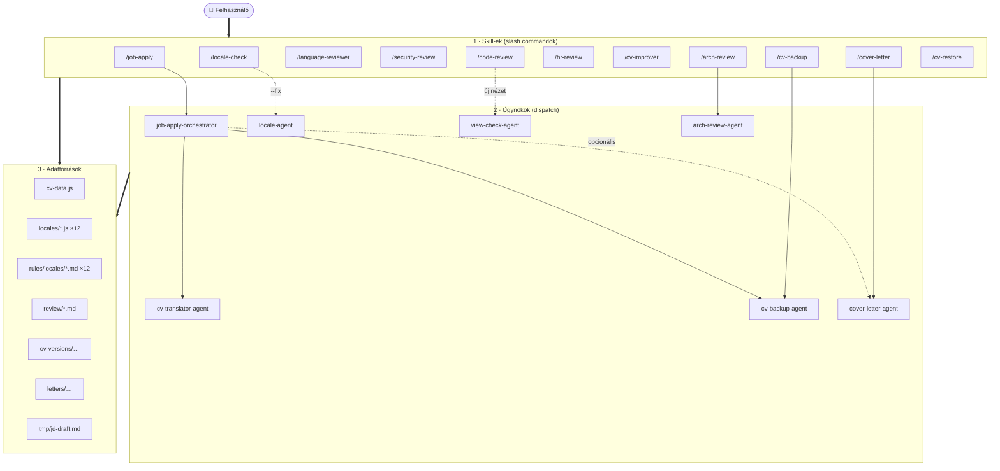
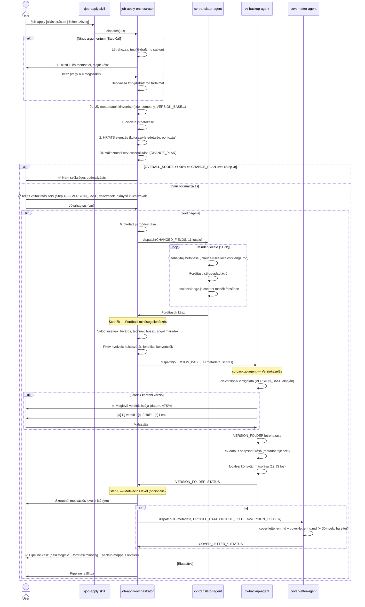
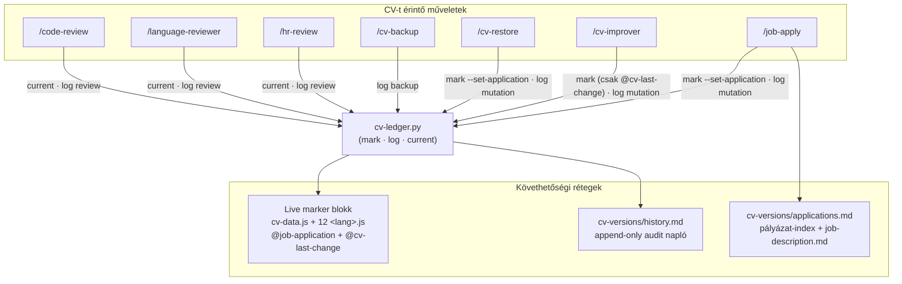
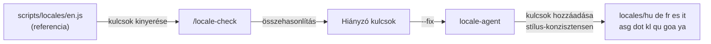
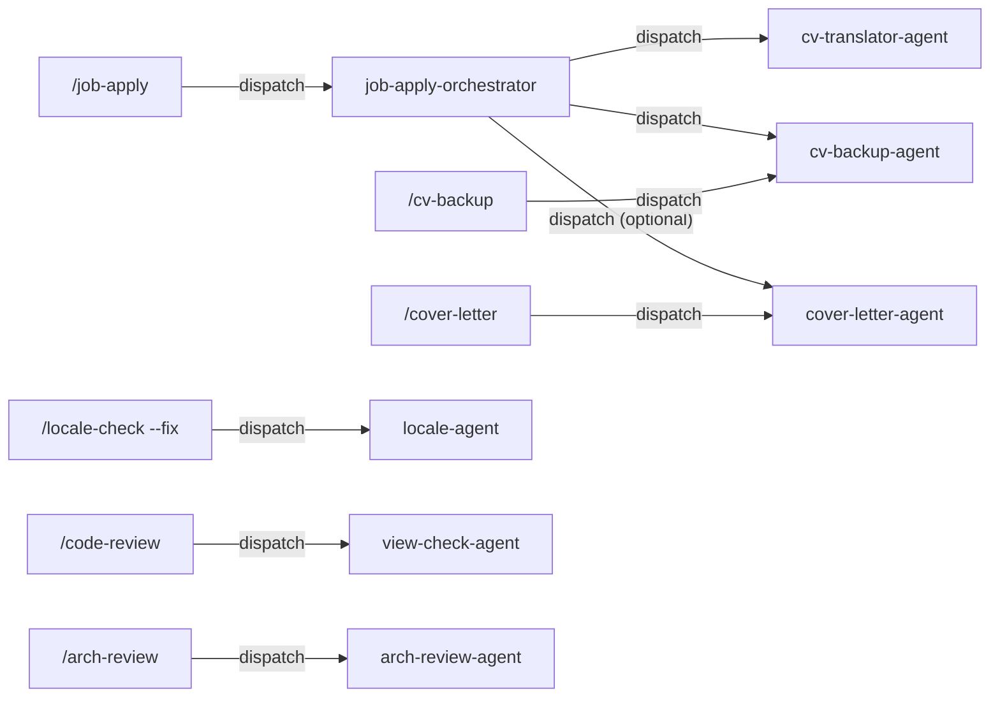

# AI Workflow — CV Projekt

A CV projekthez épített AI asszisztens rendszer dokumentációja.
A rendszer Claude Code skill-ekből és agent-ekből áll, amelyek a fejlesztési,
tartalom-karbantartási és álláspályázati munkafolyamatokat automatizálják.

---

## Architektúra áttekintés

A rendszer három rétegből áll: a felhasználó **skill-eket** (slash commandok) hív; egyes skill-ek **ügynököket** indítanak (dispatch); a skill-ek és ügynökök közös **adatforrásokon** dolgoznak. Az alábbi áttekintés az orchestrációt mutatja — a részletes, kulcsonkénti adatfolyamokat a lenti dedikált diagramok és táblázatok írják le.



---

## Skill-ek részletezése

### Fejlesztési skill-ek

| Skill                            | Trigger                  | Output                                 | Review fájl                                   |
| -------------------------------- | ------------------------ | -------------------------------------- | --------------------------------------------- |
| `/locale-check`                  | Bármikor                 | Hiányzó locale kulcsok listája         | —                                             |
| `/locale-check --fix`            | Hiányzó kulcsok javítása | `locale-agent` dispatch                | `locales/*.js`                                |
| `/code-review`                     | Commit előtt             | Locale, aria, biztonsági audit         | —                                             |
| `/code-review --fix`               | Commit előtt             | Javítások alkalmazása                  | `shared.js` / HTML                            |
| `/language-reviewer [lang\|all]` | Minőségellenőrzés        | Lektorálási megjegyzések               | —                                             |
| `/security-review`               | Periodikusan             | Spam/flood biztonsági audit            | `review/YYYY-MM-DD_HHMM_security-review.md`   |
| `/arch-review [--focus=...]`     | Architektúra-elemzés     | Template/adat/locale/CSS/tooling audit | `review/YYYY-MM-DD_HHMM_arch-review-FOCUS.md` |

### Tartalom és backup skill-ek

| Skill                   | Trigger                 | Output                                        | Review fájl                                       |
| ----------------------- | ----------------------- | --------------------------------------------- | ------------------------------------------------- |
| `/hr-review`            | Általános CV ellenőrzés | ATS minőségértékelés                          | — / `review/YYYY-MM-DD_HHMM_hr-review-general.md` |
| `/hr-review <JD>`       | Állásra pályázás előtt  | Kulcsszó-egyezés + javaslatok                 | `review/YYYY-MM-DD_HHMM_hr-review-SLUG.md`        |
| `/cv-improver <report>` | Hr-review után          | cv-data.js módosítás                          | `scripts/cv-data.js`                              |
| `/cv-backup [label]`    | Kézi mentési pont       | Snapshot mappa: `cv-versions/DATE_[label]/`   | —                                                 |
| `/cv-restore <folder>`  | Visszaállítás           | cv-data.js + 11 locale content visszaállítva  | —                                                 |
| `/cover-letter [JD]`    | Motivációs levél        | EN + HU levél → `letters/DATE_company_title/` | —                                                 |
| `/job-apply [JD]`       | Állásra pályázáskor     | Teljes pipeline (lásd lent)                   | `cv-versions/DATE_ceg_pozicio/`                   |

> **Review fájlok egységes helye:** `./review/` — dátum-időbélyeges fájlnevekkel (`YYYY-MM-DD_HHMM_<típus>[-fókusz].md`)

---

## Job-apply pipeline

Ez a legösszetettebb munkafolyamat — a `/job-apply` skill triggereli a `job-apply-orchestrator` agentet,
amely a végén a `cv-backup-agent`-et hívja a verzió snapshot elkészítéséhez.



### Amit a verzió mappa tartalmaz

A verzió snapshot egy **mappa**: `cv-versions/YYYY-MM-DD_ceg-slug_pozicio-slug[-vN]/`

```
cv-versions/
  2026-06-13_acme-corp_senior-frontend-engineer/
    cv-data.js              ← optimalizált CV adat snapshot (metaadat fejléccel)
    locales/                 ← teljes scripts/locales/ könyvtár (12 JS fájl)
    job-description.md       ← formázott állásleírás — egy fájlban: angol + magyar + eredeti
```

A `cv-data.js` tetején lévő komment blokk:

```js
/**
 * CV Data — Job Application Version
 * ============================================================
 * Optimized for: Senior Frontend Engineer @ Acme Corp
 * Seniority:     Senior
 * Domain:        SaaS / FinTech
 * Date:          2026-06-13 14:30
 * ATS match:     87% (95% required · 72% preferred)
 * HR Review:     review/2026-06-13_acme-corp_hr-review.md
 * Changes:       3 modifications (summary, skill order, 1 bullet rephrase)
 * Locale:        locales/ directory — full locale files included
 * ============================================================
 * Point-in-time snapshot for the above position.
 * Do not import directly — use scripts/cv-data.js.
 */
```

A `locales/` mappa tartalmazza mind a 12 locale fájlt (hu, de, fr, es, it, asg, dot, kl, qu, goa, ya + en) az eredeti JS formátumban.
Visszaállítás: `/cv-restore <mappa-neve>` — a `scripts/locales/` könyvtár teljes egészében visszamásolódik.

### Verziókezelési logika (cv-backup-agent)

A `cv-backup-agent` kezeli a verzióütközéseket, ha ugyanarra a cégre/pozícióra már létezik snapshot:

| Opció           | Eredmény                   | Mappa neve                |
| --------------- | -------------------------- | ------------------------- |
| `[a]` Új verzió | Új mappa létrehozása       | `SLUG-v2/`, `SLUG-v3/`... |
| `[b]` Felülírás | Legutóbbi mappa felülírása | változatlan               |
| `[n]` Leállás   | Semmi nem változik         | —                         |

---

## CV Backup és Restore

A backup/restore rendszer önállóan is használható — nem csak a `/job-apply` pipeline részeként.

### `/cv-backup [label]` — Kézi mentési pont

```
/cv-backup                    → cv-versions/2026-06-13_manual/
/cv-backup pre-refactor       → cv-versions/2026-06-13_manual_pre-refactor/
/cv-backup before-big-edit    → cv-versions/2026-06-13_manual_before-big-edit/
```

Mikor érdemes használni:

- Kézi szerkesztés előtt
- Kísérletezés, refaktor előtt
- Amikor nem állásra pályázol, de el akarod menteni a jelenlegi állapotot

A `/cv-backup` skill mögött egy Python CLI script is található
`.claude/skills/cv-backup/scripts/cv-backup.py`, amely közvetlenül is futtatható:

```bash
python .claude/skills/cv-backup/scripts/cv-backup.py                           # kézi snapshot
python .claude/skills/cv-backup/scripts/cv-backup.py --label pre-refactor      # megnevezett snapshot
python .claude/skills/cv-backup/scripts/cv-backup.py \
    --company "Acme Corp" --title "Senior FE" --score 87 \
    --required-score 95 --preferred-score 72 \
    --changes "summary + skill order" --seniority Senior --domain SaaS
```

### `/cv-restore <folder>` — Visszaállítás

```
/cv-restore 2026-06-13_acme-corp_senior-frontend-engineer
/cv-restore 2026-06-13_manual_pre-refactor
```

A skill visszaállítja:

- `scripts/cv-data.js` — a snapshot tartalmát (fejléc komment nélkül)
- `scripts/locales/hu.js` ... `ya.js` — mind a 11 locale `content` mezőjét

A visszaállítás CLI scripttel is végezhető:

```bash
python .claude/skills/cv-restore/scripts/cv-restore.py <folder-name>           # visszaállítás
python .claude/skills/cv-restore/scripts/cv-restore.py --list                  # backupok listázása
python .claude/skills/cv-restore/scripts/cv-restore.py <folder> --yes          # jóváhagyás kihagyása
```

**Biztonsági lépések:**

1. Megmutatja a snapshot metaadatait (pozíció, dátum, ATS%, módosítások)
2. Felsorolja a felülírandó fájlokat
3. Csak `y` jóváhagyás után módosít bármit
4. A jóváhagyás után **automatikusan** készít egy `pre-restore` biztonsági mentést a jelenlegi
   állapotról (`cv-versions/DATE_manual_pre-restore/`), mielőtt bármit felülírna — ha ez nem
   sikerül, megszakítja a visszaállítást (`--no-backup` kapcsolja ki)
5. A visszaállítás után a markert a visszaállított verzióra állítja és sort ír a `history.md`-be

---

## CV verzió-követhetőség (traceability)

Cél: bármikor megválaszolható legyen, **mikor melyik CV-verzióval mi történt**. Az egész CV-állapot
egyetlen azonosítóval (`APP_ID` = a snapshot mappa neve, `DATE_company_title`) követhető, három,
egymást kiegészítő rétegen át. Mindhárom réteget egyetlen helper tartja szinkronban:
[`.claude/scripts/cv-ledger.py`](../.claude/scripts/cv-ledger.py).



**1. Live marker blokk** — kétsoros comment a `scripts/cv-data.js` és a 12 CV-tartalom locale
(`scripts/locales/<lang>.js`, **nem** a `-page.js` felirat-fájlok) tetején:

```js
// @job-application: APP_ID — Title @ Company (date) · snapshot: cv-versions/APP_ID/
// @cv-last-change: YYYY-MM-DD HHMM — művelet (aktor) · see cv-versions/history.md
```

- `@job-application` — melyik verzióra van hangolva a live CV. `/job-apply` állítja be, `/cv-restore`
  a visszaállított verzióra írja át. A `/cv-improver` **nem** változtatja (csak a tartalom drift-el).
- `@cv-last-change` — a legutóbbi bármilyen módosítás. `/job-apply`, `/cv-improver`, `/cv-restore` frissíti.

**2. `cv-versions/history.md`** — append-only audit napló. **Minden** CV-esemény egy sor:
`mutation` (job-apply, cv-improver, cv-restore), `backup` (snapshot készült) és `review`
(hr-review, language-reviewer, code-review — read-only elemzés is). Oszlopok: Időpont · Kategória ·
Művelet · Aktor · APP_ID · Mi történt · Artefaktum.

**3. `cv-versions/applications.md`** — pályázat-index (egy sor / APP_ID: állás → CV-verzió +
fordítások + motivációs levél). A formázott állásleírás a `cv-versions/APP_ID/job-description.md`-ben.

**Vezérelv:** egyetlen skill/agent sem írja kézzel a markert vagy a naplót — mindig a
`cv-ledger.py`-t hívják (`mark` / `log` / `current`). A read-only review-k a `current`-tel olvassák
ki a vizsgált verziót, és a riportjuk fejlécébe teszik. Formátumok:
[`.claude/rules/version-snapshot-format.md`](../.claude/rules/version-snapshot-format.md).

---

## Fordítási minőség-ellenőrzés (Step 7b)

A fordítások elkészülte után az orchestrator automatikusan spot-checket futtat:

### Valódi nyelvek (hu, de, fr, es, it)

| Ellenőrzés                              | ✅ átmegy                             | ⚠️ figyelmeztet          |
| --------------------------------------- | ------------------------------------- | ------------------------ |
| Nagybetűs kezdés és pont végén          | ✓                                     | Hiányzik                 |
| Technológia nevek megőrzése             | TypeScript, React, Svelte stb. megvan | kisbetűs vagy lefordítva |
| Summary hossz a fix budget −5%/+2% sávjában | Belül                             | Kívül                    |
| Nem marad lefordítatlan angol mondat    | Nincs angol bekezdés                  | Van angol bekezdés       |

Eredmény: `✅ Ellenőrzött fordítás` vagy `⚠️ Emberi ellenőrzés ajánlott`

### Fiktív nyelvek (asg, dot, kl, qu, goa, ya)

Mindig: `⚠️ Stílus-adaptáció (emberi ellenőrzés ajánlott)` — ez várt viselkedés, nem hiba.

A spot-check ellenőrzi a kulcsszótár meglétét és a fonetikai konvenciókat (pl. aposztróf Klingonban, diaeresis Quenya-ban), de a stílus-adaptáció kreatív jellege miatt az emberi ellenőrzés mindig javasolt.

---

## Fordítási hossz-budget (Step 7d)

A Step 7b emberi szintű spot-check; rajta felül a Step 7d egy **automatikus, kötelező**
ellenőrzés futtatja a [`check-translation-lengths.py`](../.claude/scripts/check-translation-lengths.py)
scriptet, ami a [`.claude/rules/translation-length.md`](../.claude/rules/translation-length.md)
szabályt kényszeríti ki.

**A budget FIX, beégetett — NEM a `cv-data.js`-ből számolódik futásonként.** Két helyen él,
és a kettőnek egyeznie kell:

1. a szabályfájl táblázata (mérvadó, kézzel karbantartott),
2. [`.claude/reference/current-english-lengths.json`](../.claude/reference/current-english-lengths.json) — ugyanaz JSON-ban, ezt olvassa a script.

Csak **két dolgot** ellenőriz, mindkettőt a budget **−5% … +2%** sávjában:

- **hero (summary)** — az összefoglaló hossza,
- **munkahelyenkénti összeg** — `description` + összes `bullets[]` + összes `projects[].bullets[]` együtt.

NINCS ellenőrizve: community, education, hobbyProjects, programmingLanguages, skillGroups.

```bash
cd scripts/locales
python ../../.claude/scripts/check-translation-lengths.py   # exit 1, ha bármi a sávon kívül
```

Ha a script 1-gyel lép ki, a pipeline **nem mehet tovább** a Step 8-ra: a túl rövid mezőket
bővíteni, a túl hosszúakat tömöríteni kell, majd újra futtatni, amíg 0-val ki nem lép. A
`cv-translator-agent` már a fordítás közben is erre a budget-re dolgozik; a Step 7d csak a
független, automatikus megerősítés.

> ⚠️ A budget-ot soha ne generáld újra a `cv-data.js`-ből. Ha az angol tartalom változik
> (pl. egy `/job-apply` átírja a summary-t), a budget akkor sem változik — a fix
> layout-kapacitást védi. Módosítása tudatos, kézi döntés: a táblázatot ÉS a JSON-t együtt.

---

## Locale management pipeline



Az `en.js` mindig a referencia. A `locale-agent` a kulcs beillesztésekor:

- Valódi nyelveknél (hu, de, fr, es, it): fordítja az értéket
- Fiktív nyelveknél (asg, dot, kl, qu, goa, ya): a szomszéd kulcsok stílusát másolja

---

## Hogyan triggereld a skill-eket és agent-eket

### Job-apply pipeline

```
/job-apply állásleírás.txt
/job-apply "Senior Frontend Engineer at Acme Corp. Requirements: React, TypeScript..."
/job-apply                    ← interaktív sablon (tmp/jd-draft.md)
```

Ha nincs argumentum, az orchestrator interaktívan megnyitja a `tmp/jd-draft.md` sablont.
A sablont kitöltöd, mentesz, majd beírod: `kész`

### Backup és restore

```
/cv-backup                          ← egyszerű snapshot
/cv-backup pre-refactor             ← megnevezett snapshot
/cv-restore 2026-06-13_manual       ← visszaállítás mappa névvel
```

### Sub-agentek közvetlen hívása

A `cv-translator-agent` hívható közvetlenül is, ha már módosítottad a cv-data.js-t
és csak a fordításokat akarod frissíteni:

```
Futtasd a cv-translator-agent agentet. A megváltozott mezők:
- summary: régi szöveg → új szöveg
- Aegex bullet 1: régi → új
```

A `cv-backup-agent` is hívható önállóan, ha az orchestratoron kívül szeretnél snapshotot:

```
Futtasd a cv-backup-agent agentet. MODE=manual, VERSION_BASE=2026-06-13_manual_test
```

---

## Agent-ek közötti kapcsolatok



Jelenleg nincs körkörös függőség — a gráf irányított és aciklikus (DAG).

---

## Szabályfájlok

A `.claude/rules/locales/` mappában mind a 12 locale-hoz van szabályfájl:

| Fájl     | Tartalom                                               |
| -------- | ------------------------------------------------------ |
| `en.md`  | Angol CV írásstílus, igeidők, terminológia             |
| `hu.md`  | Magyar szakmai regiszter, igeragozás, tegező forma     |
| `de.md`  | Német CV konvenciók, főnév-nagybetűzés, Sie-forma      |
| `fr.md`  | Francia CV, vouvoiement, tipográfiai szabályok         |
| `es.md`  | Spanyol CV, usted/tuteo, hangsúlyjelek                 |
| `it.md`  | Olasz CV, lei/tu forma, participio passato             |
| `asg.md` | Asgardian stílusszabályok, kulcsszótár                 |
| `dot.md` | Dothraki stílus, `anha`/`anni` pronominák              |
| `kl.md`  | Klingon fonetika, Q/H/D nagybetűk, aposztróf szabályok |
| `qu.md`  | Quenya fonetika, diaeresis (`ë`), szótár               |
| `goa.md` | Goa'uld stílus, `Kree!` parancsok, apostróf szavak     |
| `ya.md`  | Yautja stílus, gutturális hangok, szótár               |

A `language-reviewer`, `cv-translator-agent` és `cover-letter-agent` ezeket töltik be futás közben.

Egyéb szabályfájlok:

| Fájl                                         | Tartalom                                                                                                                                 |
| -------------------------------------------- | ---------------------------------------------------------------------------------------------------------------------------------------- |
| `.claude/rules/jd-draft-template.md`         | A `tmp/jd-draft.md` pontos sablonja és kezelési logikája                                                                                 |
| `.claude/rules/version-snapshot-format.md`   | Verzió mappa névformátum, cv-data.js fejléc blokk, locales/, job-description.md, history.md, applications.md és a marker blokk formátuma |
| `.claude/rules/arch-review-report-format.md` | Az arch-review riport teljes markdown sablona                                                                                            |

---

## Skill scriptek (CLI eszközök)

Néhány skillhez tartozik önálló Python CLI script, amely a skill `.claude/skills/{skillName}/scripts/`
mappájában található. Ezek közvetlenül futtathatók a projekt gyökeréből:

| Script                                                | Skill           | Funkció                                                                                                                                 |
| ----------------------------------------------------- | --------------- | --------------------------------------------------------------------------------------------------------------------------------------- |
| `.claude/scripts/cv-ledger.py`                        | _(megosztott)_  | Verzió-követhetőség: marker blokk (`mark`), audit napló (`log`), aktuális verzió (`current`) — lásd a _CV verzió-követhetőség_ szekciót |
| `.claude/skills/cv-backup/scripts/cv-backup.py`       | `/cv-backup`    | CV snapshot készítése (automatikusan `backup` sort ír a history.md-be a cv-ledger-en át)                                                |
| `.claude/skills/cv-restore/scripts/cv-restore.py`     | `/cv-restore`   | CV visszaállítása backupból (auto pre-restore mentés + marker + history napló)                                                          |
| `.claude/skills/locale-check/scripts/locale-check.py` | `/locale-check` | Locale kulcsok ellenőrzése (JSON kimenettel is)                                                                                         |

### locale-check.py — parancssori használat

```bash
python .claude/skills/locale-check/scripts/locale-check.py                     # ellenőrzés
python .claude/skills/locale-check/scripts/locale-check.py --json              # JSON kimenet (tool-oknak)
python .claude/skills/locale-check/scripts/locale-check.py --fix               # AI agent által (nem CLI-ből)
```

> **Megjegyzés:** A CLI scriptek önállóan is használhatók, de a `/skill` parancsok többletszolgáltatást nyújtanak
> (AI agentekkel való interakció, verzióütközés-kezelés, stb.).

---

## Ideiglenes fájlok

| Fájl              | Mikor keletkezik               | Mikor törölhető          |
| ----------------- | ------------------------------ | ------------------------ |
| `tmp/jd-draft.md` | `/job-apply` argumentum nélkül | Pipeline befejezése után |

A `tmp/` mappa a `.gitignore`-ba kerülhet — csak ideiglenes szerkesztési célra való.
