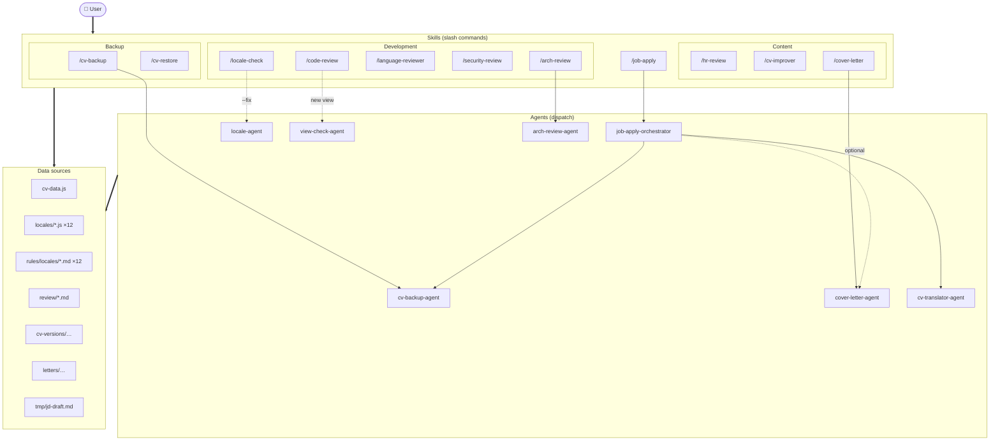
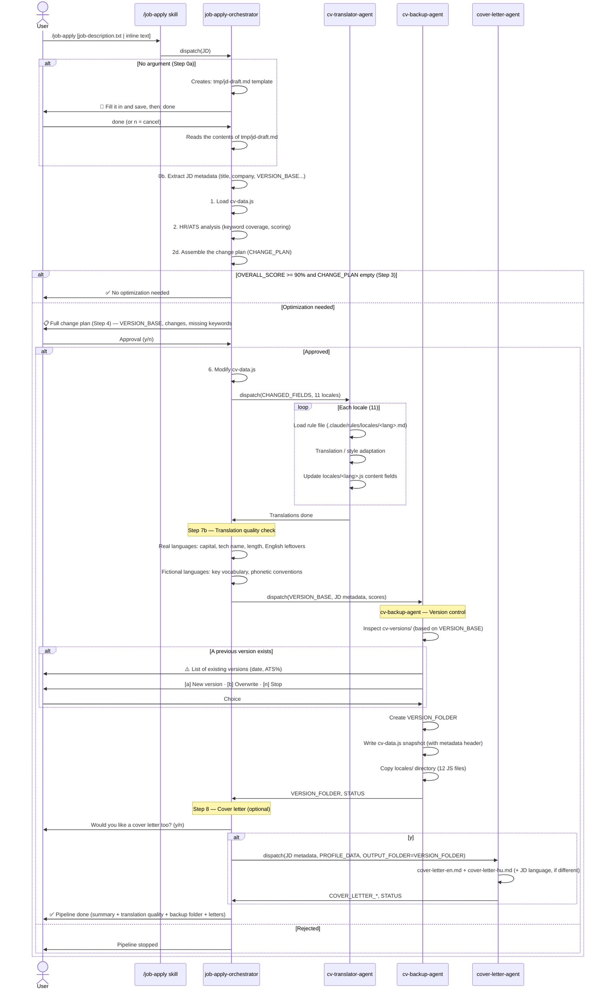
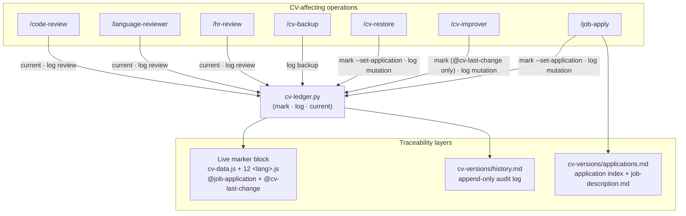
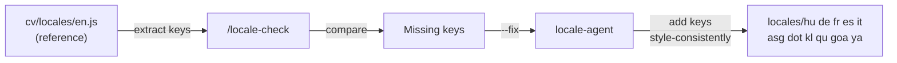
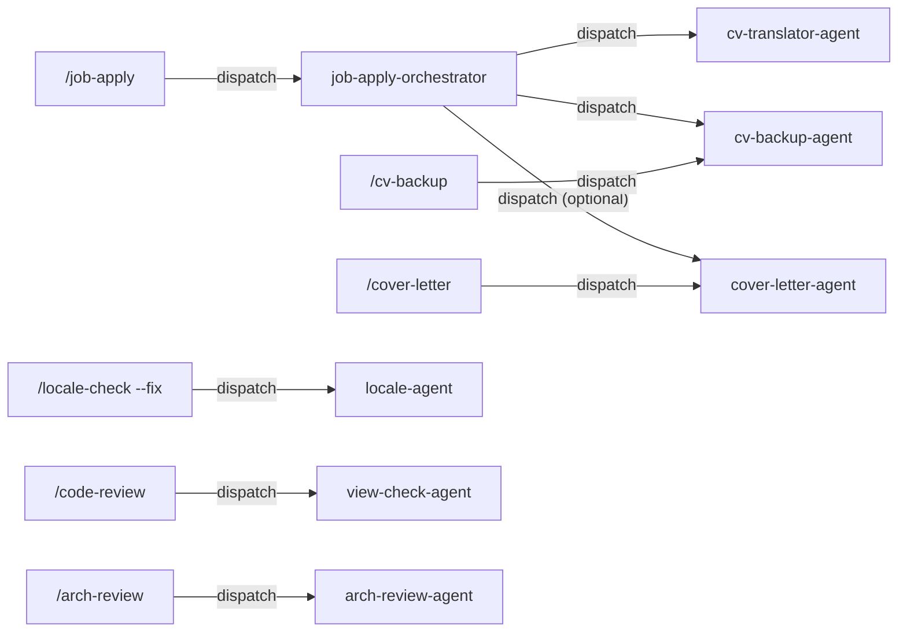

# AI Workflow — CV Project

> 🌐 **Language:** 🇬🇧 English · [🇭🇺 Magyar](ai-workflow-hu.md)

Documentation of the AI assistant system built for the CV project.
The system consists of Claude Code skills and agents that automate development,
content-maintenance, and job-application workflows.

---

## Architecture overview

The system has three layers: the user invokes **skills** (slash commands); some skills launch **agents** (dispatch); skills and agents work on shared **data sources**. The overview below shows the orchestration — the detailed, per-key data flows are described by the dedicated diagrams and tables further down.



---

## Skills in detail

### Development skills

| Skill                            | Trigger                  | Output                                 | Review file                                   |
| -------------------------------- | ------------------------ | -------------------------------------- | --------------------------------------------- |
| `/locale-check`                  | Anytime                  | List of missing locale keys            | —                                             |
| `/locale-check --fix`            | Fix missing keys         | `locale-agent` dispatch                | `locales/*.js`                                |
| `/code-review`                   | Before commit            | Locale, aria, security audit           | —                                             |
| `/code-review --fix`             | Before commit            | Apply fixes                            | `shared.js` / HTML                            |
| `/language-reviewer [lang\|all]` | Quality check            | Proofreading notes                     | —                                             |
| `/security-review`               | Periodically             | Spam/flood security audit              | `review/YYYY-MM-DD_HHMM_security-review.md`   |
| `/arch-review [--focus=...]`     | Architecture analysis    | Template/data/locale/CSS/tooling audit | `review/YYYY-MM-DD_HHMM_arch-review-FOCUS.md` |

### Content and backup skills

| Skill                   | Trigger                | Output                                        | Review file                                       |
| ----------------------- | ---------------------- | --------------------------------------------- | ------------------------------------------------- |
| `/hr-review`            | General CV check       | ATS quality assessment                        | — / `review/YYYY-MM-DD_HHMM_hr-review-general.md` |
| `/hr-review <JD>`       | Before applying        | Keyword match + recommendations               | `review/YYYY-MM-DD_HHMM_hr-review-SLUG.md`        |
| `/cv-improver <report>` | After hr-review        | cv-data.js modification                       | `cv/cv-data.js`                                   |
| `/cv-backup [label]`    | Manual save point      | Snapshot folder: `cv-versions/DATE_[label]/`  | —                                                 |
| `/cv-restore <folder>`  | Restore                | cv-data.js + 11 locale contents restored      | —                                                 |
| `/cover-letter [JD]`    | Cover letter           | EN + HU letter → `letters/DATE_company_title/` | —                                                 |
| `/job-apply [JD]`       | When applying for a job | Full pipeline (see below)                     | `cv-versions/DATE_company_position/`              |

> **Unified location of review files:** `./review/` — with date-timestamped filenames (`YYYY-MM-DD_HHMM_<type>[-focus].md`)

---

## Job-apply pipeline

This is the most complex workflow — the `/job-apply` skill triggers the `job-apply-orchestrator` agent,
which at the end calls `cv-backup-agent` to create the version snapshot.



### What the version folder contains

The version snapshot is a **folder**: `cv-versions/YYYY-MM-DD_company-slug_position-slug[-vN]/`

```
cv-versions/
  2026-06-13_acme-corp_senior-frontend-engineer/
    cv-data.js              ← optimized CV data snapshot (with metadata header)
    locales/                 ← full cv/locales/ directory (12 JS files)
    job-description.md       ← formatted job description — single file: English + Hungarian + original
```

The comment block at the top of `cv-data.js`:

```js
/**
 * CV Data — Job Application Version
 * ============================================================
 * Optimized for: Senior Frontend Engineer @ Acme Corp
 * Seniority:     Senior
 * Domain:        SaaS / FinTech
 * Date:          2026-06-13 14:30
 * ATS match:     87% (95% required · 72% preferred)
 * HR Review:     review/2026-06-13_acme-corp_hr-review.md
 * Changes:       3 modifications (summary, skill order, 1 bullet rephrase)
 * Locale:        locales/ directory — full locale files included
 * ============================================================
 * Point-in-time snapshot for the above position.
 * Do not import directly — use cv/cv-data.js.
 */
```

The `locales/` folder holds all 12 locale files (hu, de, fr, es, it, asg, dot, kl, qu, goa, ya + en) in the original JS format.
Restore: `/cv-restore <folder-name>` — the entire `cv/locales/` directory is copied back.

### Version-control logic (cv-backup-agent)

The `cv-backup-agent` handles version conflicts when a snapshot for the same company/position already exists:

| Option          | Result                     | Folder name               |
| --------------- | -------------------------- | ------------------------- |
| `[a]` New version | Create a new folder      | `SLUG-v2/`, `SLUG-v3/`... |
| `[b]` Overwrite | Overwrite the latest folder | unchanged                |
| `[n]` Stop      | Nothing changes            | —                         |

---

## CV Backup and Restore

The backup/restore system can also be used on its own — not only as part of the `/job-apply` pipeline.

### `/cv-backup [label]` — Manual save point

```
/cv-backup                    → cv-versions/2026-06-13_manual/
/cv-backup pre-refactor       → cv-versions/2026-06-13_manual_pre-refactor/
/cv-backup before-big-edit    → cv-versions/2026-06-13_manual_before-big-edit/
```

When it's worth using:

- Before a manual edit
- Before experimenting or refactoring
- When you're not applying for a job but want to save the current state

Behind the `/cv-backup` skill there is also a Python CLI script,
`.claude/skills/cv-backup/scripts/cv-backup.py`, which can be run directly:

```bash
python .claude/skills/cv-backup/scripts/cv-backup.py                           # manual snapshot
python .claude/skills/cv-backup/scripts/cv-backup.py --label pre-refactor      # named snapshot
python .claude/skills/cv-backup/scripts/cv-backup.py \
    --company "Acme Corp" --title "Senior FE" --score 87 \
    --required-score 95 --preferred-score 72 \
    --changes "summary + skill order" --seniority Senior --domain SaaS
```

### `/cv-restore <folder>` — Restore

```
/cv-restore 2026-06-13_acme-corp_senior-frontend-engineer
/cv-restore 2026-06-13_manual_pre-refactor
```

The skill restores:

- `cv/cv-data.js` — the contents of the snapshot (without the header comment)
- `cv/locales/hu.js` ... `ya.js` — all 11 locale `content` fields

The restore can also be done with the CLI script:

```bash
python .claude/skills/cv-restore/scripts/cv-restore.py <folder-name>           # restore
python .claude/skills/cv-restore/scripts/cv-restore.py --list                  # list backups
python .claude/skills/cv-restore/scripts/cv-restore.py <folder> --yes          # skip confirmation
```

**Safety steps:**

1. Shows the snapshot's metadata (position, date, ATS%, modifications)
2. Lists the files to be overwritten
3. Modifies nothing without a `y` confirmation
4. After confirmation it **automatically** creates a `pre-restore` backup of the current
   state (`cv-versions/DATE_manual_pre-restore/`) before overwriting anything — if this fails,
   it aborts the restore (`--no-backup` turns it off)
5. After the restore it sets the marker to the restored version and writes a row to `history.md`

---

## CV version traceability

Goal: it should always be answerable **when, which CV version, and what happened**. The entire CV state
is traceable through a single identifier (`APP_ID` = the snapshot folder name, `DATE_company_title`) across
three complementary layers. All three layers are kept in sync by a single helper:
[`.claude/scripts/cv-ledger.py`](../.claude/scripts/cv-ledger.py).



**1. Live marker block** — a two-line comment at the top of `cv/cv-data.js` and the 12 CV-content locale
files (`cv/locales/<lang>.js`, **not** the `-page.js` label files):

```js
// @job-application: APP_ID — Title @ Company (date) · snapshot: cv-versions/APP_ID/
// @cv-last-change: YYYY-MM-DD HHMM — operation (actor) · see cv-versions/history.md
```

- `@job-application` — which version the live CV is tuned for. Set by `/job-apply`, rewritten by `/cv-restore`
  to the restored version. `/cv-improver` does **not** change it (only the content drifts).
- `@cv-last-change` — the most recent change of any kind. Updated by `/job-apply`, `/cv-improver`, `/cv-restore`.

**2. `cv-versions/history.md`** — an append-only audit log. **Every** CV event is one row:
`mutation` (job-apply, cv-improver, cv-restore), `backup` (a snapshot was created), and `review`
(hr-review, language-reviewer, code-review — read-only analysis too). Columns: Timestamp · Category ·
Operation · Actor · APP_ID · What happened · Artifact.

**3. `cv-versions/applications.md`** — application index (one row / APP_ID: job → CV version +
translations + cover letter). The formatted job description is in `cv-versions/APP_ID/job-description.md`.

**Guiding principle:** no skill/agent writes the marker or the log by hand — they always call
`cv-ledger.py` (`mark` / `log` / `current`). Read-only reviews read the examined version with `current`
and put it in their report header. Formats:
[`.claude/rules/version-snapshot-format.md`](../.claude/rules/version-snapshot-format.md).

---

## Translation quality check (Step 7b)

After the translations are complete, the orchestrator automatically runs a spot-check:

### Real languages (hu, de, fr, es, it)

| Check                                    | ✅ passes                            | ⚠️ warns                 |
| ---------------------------------------- | ------------------------------------- | ------------------------ |
| Capitalized start and period at the end  | ✓                                     | Missing                  |
| Technology names preserved               | TypeScript, React, Svelte etc. present | lowercased or translated |
| Summary length within the fixed budget's −5%/+2% band | Inside                  | Outside                  |
| No untranslated English sentence remains | No English paragraph                  | There is an English paragraph |

Result: `✅ Verified translation` or `⚠️ Human review recommended`

### Fictional languages (asg, dot, kl, qu, goa, ya)

Always: `⚠️ Style adaptation (human review recommended)` — this is expected behavior, not an error.

The spot-check verifies the presence of the key vocabulary and the phonetic conventions (e.g. apostrophe in Klingon, diaeresis in Quenya), but because of the creative nature of style adaptation, human review is always advised.

---

## Translation length budget (Step 7d)

Step 7b is a human-level spot-check; on top of it, Step 7d runs an **automatic, mandatory**
check via the [`check-translation-lengths.py`](../.claude/scripts/check-translation-lengths.py)
script, which enforces the [`.claude/rules/translation-length.md`](../.claude/rules/translation-length.md)
rule.

**The budget is FIXED and hard-coded — it is NOT computed from `cv-data.js` per run.** It lives in two places,
and the two must match:

1. the rule file's table (authoritative, manually maintained),
2. [`.claude/reference/current-english-lengths.json`](../.claude/reference/current-english-lengths.json) — the same in JSON, which the script reads.

It checks only **two things**, both within the budget's **−5% … +2%** band:

- **hero (summary)** — the length of the summary,
- **per-workplace total** — `description` + all `bullets[]` + all `projects[].bullets[]` together.

NOT checked: community, education, hobbyProjects, programmingLanguages, skillGroups.

```bash
cd cv/locales
python ../../.claude/scripts/check-translation-lengths.py   # exit 1 if anything is outside the band
```

If the script exits with 1, the pipeline **cannot proceed** to Step 8: the too-short fields must be
expanded and the too-long ones compressed, then run again until it exits with 0. The
`cv-translator-agent` already works to this budget during translation; Step 7d is just the
independent, automatic confirmation.

> ⚠️ Never regenerate the budget from `cv-data.js`. If the English content changes
> (e.g. a `/job-apply` rewrites the summary), the budget still does not change — it protects the fixed
> layout capacity. Modifying it is a deliberate, manual decision: the table AND the JSON together.

---

## Locale management pipeline



`en.js` is always the reference. When inserting a key, the `locale-agent`:

- For real languages (hu, de, fr, es, it): translates the value
- For fictional languages (asg, dot, kl, qu, goa, ya): copies the style of the neighboring keys

---

## How to trigger the skills and agents

### Job-apply pipeline

```
/job-apply job-description.txt
/job-apply "Senior Frontend Engineer at Acme Corp. Requirements: React, TypeScript..."
/job-apply                    ← interactive template (tmp/jd-draft.md)
```

If there is no argument, the orchestrator interactively opens the `tmp/jd-draft.md` template.
You fill in the template, save, then type: `done`

### Backup and restore

```
/cv-backup                          ← simple snapshot
/cv-backup pre-refactor             ← named snapshot
/cv-restore 2026-06-13_manual       ← restore with a folder name
```

### Calling sub-agents directly

The `cv-translator-agent` can also be called directly if you've already modified cv-data.js
and only want to refresh the translations:

```
Run the cv-translator-agent. The changed fields:
- summary: old text → new text
- Aegex bullet 1: old → new
```

The `cv-backup-agent` can also be called on its own if you want a snapshot outside the orchestrator:

```
Run the cv-backup-agent. MODE=manual, VERSION_BASE=2026-06-13_manual_test
```

---

## Relationships between agents



There is currently no circular dependency — the graph is directed and acyclic (DAG).

---

## Rule files

In the `.claude/rules/locales/` directory there is a rule file for each of the 12 locales:

| File     | Content                                                |
| -------- | ------------------------------------------------------ |
| `en.md`  | English CV writing style, tenses, terminology          |
| `hu.md`  | Hungarian professional register, conjugation, informal address |
| `de.md`  | German CV conventions, noun capitalization, Sie form   |
| `fr.md`  | French CV, vouvoiement, typographic rules              |
| `es.md`  | Spanish CV, usted/tuteo, accent marks                  |
| `it.md`  | Italian CV, lei/tu form, participio passato            |
| `asg.md` | Asgardian style rules, key vocabulary                  |
| `dot.md` | Dothraki style, `anha`/`anni` pronouns                 |
| `kl.md`  | Klingon phonetics, Q/H/D capitals, apostrophe rules    |
| `qu.md`  | Quenya phonetics, diaeresis (`ë`), vocabulary          |
| `goa.md` | Goa'uld style, `Kree!` commands, apostrophe words      |
| `ya.md`  | Yautja style, guttural sounds, vocabulary              |

The `language-reviewer`, `cv-translator-agent`, and `cover-letter-agent` load these at run time.

Other rule files:

| File                                         | Content                                                                                                                                |
| -------------------------------------------- | ------------------------------------------------------------------------------------------------------------------------------------- |
| `.claude/rules/jd-draft-template.md`         | The exact template and handling logic of `tmp/jd-draft.md`                                                                            |
| `.claude/rules/version-snapshot-format.md`   | Version folder naming format, cv-data.js header block, locales/, job-description.md, history.md, applications.md, and the marker block format |
| `.claude/rules/arch-review-report-format.md` | The full markdown template of the arch-review report                                                                                  |

---

## Skill scripts (CLI tools)

Some skills have a standalone Python CLI script, located in the skill's `.claude/skills/{skillName}/scripts/`
directory. These can be run directly from the project root:

| Script                                                | Skill           | Function                                                                                                                                |
| ----------------------------------------------------- | --------------- | ------------------------------------------------------------------------------------------------------------------------------------- |
| `.claude/scripts/cv-ledger.py`                        | _(shared)_      | Version traceability: marker block (`mark`), audit log (`log`), current version (`current`) — see the _CV version traceability_ section |
| `.claude/skills/cv-backup/scripts/cv-backup.py`       | `/cv-backup`    | Create a CV snapshot (automatically writes a `backup` row to history.md via cv-ledger)                                                 |
| `.claude/skills/cv-restore/scripts/cv-restore.py`     | `/cv-restore`   | Restore the CV from a backup (auto pre-restore save + marker + history log)                                                            |
| `.claude/skills/locale-check/scripts/locale-check.py` | `/locale-check` | Check locale keys (with JSON output too)                                                                                              |

### locale-check.py — command-line usage

```bash
python .claude/skills/locale-check/scripts/locale-check.py                     # check
python .claude/skills/locale-check/scripts/locale-check.py --json              # JSON output (for tools)
python .claude/skills/locale-check/scripts/locale-check.py --fix               # via AI agent (not from CLI)
```

> **Note:** The CLI scripts can be used standalone, but the `/skill` commands provide added value
> (interaction with AI agents, version-conflict handling, etc.).

---

## Temporary files

| File              | When it is created             | When it can be deleted   |
| ----------------- | ------------------------------ | ------------------------ |
| `tmp/jd-draft.md` | `/job-apply` without an argument | After the pipeline finishes |

The `tmp/` folder can be added to `.gitignore` — it is only meant for temporary editing.
