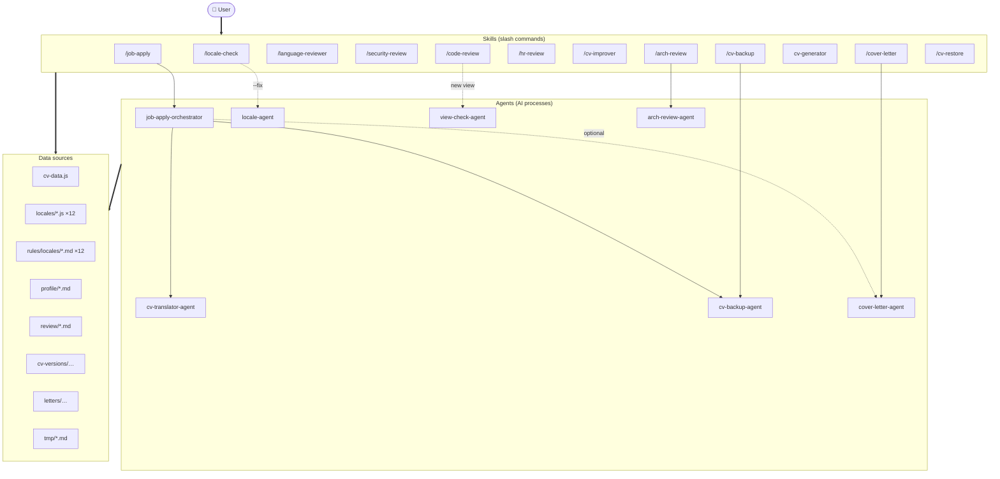

# Skills & Agents — Complete Reference Guide

> 🌐 **Language:** 🇬🇧 English · [🇭🇺 Magyar](skills-and-agents-guide-hu.md)

## Introduction

The CV project comes with an AI-assistant system built from **skills** (slash commands)
and **agents** (specialized AI-based processors). The system runs in Claude Code,
and all configuration is found under the `.claude/` directory.

**Principles:**
- **Skills** (= `/commands`) are operations the user can use directly
- **Agents** are specialized AI processors invoked by the skills
- Every operation is logged in the `cv-versions/history.md` file
- Every review report goes into the `review/` folder
- The user-interface language is Hungarian; the file names and code are English

---

# 1. Skills in Detail

## 1.1 Development / Maintenance Skills

---

### `/locale-check` — Locale Key Check

**Trigger:** `/locale-check` or `/locale-check --fix`

**Function:** Checks whether all 12 locale files (`*-page.js`) contain the same `labels` keys
as the `en-page.js` reference. It can automatically fill in the missing
keys with the `--fix` switch.

**How it works:**
1. Reads all `labels` keys from `en-page.js` → this is the reference
2. Compares every other `*-page.js` file with it
3. Reports the missing keys per file

**`--fix` mode:**
- Calls the `locale-agent`, which:
  - For real languages (hu, de, fr, es, it): translates the new key's value
  - For fictional languages (asg, dot, kl, qu, goa, ya): makes a style-consistent adaptation

**Use cases:**
```bash
/locale-check              # check only, no modification
/locale-check --fix        # automatically fill in missing keys
```

**What it does NOT do:**
- Does not modify `en.js` (that's the reference, read-only)
- Does not delete keys
- Only checks the `labels` object, not `content`

---

### `/code-review` — CV Project Compatibility Check

**Trigger:** `/code-review` or `/code-review --fix`

**Function:** A full code review for the CV project. Checks locale completeness,
aria label compliance, XSS security, config hygiene, and the new-view checklist.

**Areas checked:**
1. **Locale completeness** — new keys added to every `*-page.js`?
2. **Aria label compliance** — hardcoded vs. `locale.t()` usage, icon-only buttons
3. **Security** — `.innerHTML` with dynamic content, `insertAdjacentHTML` check
4. **Config hygiene** — hardcoded URLs, localStorage keys
5. **New-view checklist** — if it detects a new `cv-*.html` file, it calls the `view-check-agent`

**`--fix` mode:**
- Fixes only the fixable warnings (e.g. hardcoded aria strings)
- Does NOT auto-fix security issues — always shows the change

**What it does NOT do:**
- Does not modify locale files (the `locale-agent` does that)
- Does not apply security changes without confirmation

---

### `/language-reviewer` — Language Proofreading

**Trigger:** `/language-reviewer <lang>` or `/language-reviewer all`

**Function:** Professional language proofreading. Checks the CV content and UI labels
based on language-specific rules.

**Parameters:**
- `<lang>` — a specific language: `en`, `hu`, `de`, `fr`, `es`, `it`, `asg`, `dot`, `kl`, `qu`, `goa`, `ya`
- `all` — check all languages

**Aspects checked:**
- Register and tone (formal/informal, formal/informal address)
- Tense consistency
- Correctness of technical terminology (TypeScript, React, etc.)
- Language-specific grammar (genders, cases, conjugation)
- Key-vocabulary consistency (for fictional languages)
- Keys missing relative to `en-page.js`
- Cultural fit of placeholder texts

**What it does NOT do:**
- Never modifies files — only reports
- Does not suggest content changes (skills, experience, dates)

---

### `/security-review` — Security Audit

**Trigger:** `/security-review` or `/security-review --fix`

**Function:** A spam and security audit of the CV site's interactive features (Hire Me form,
Booking modal). Since the site has no backend, the focus is on client-side protection.

**Areas checked:**
1. **Hire Me form (Formspree):** rate limiting, input validation, bot protection, XSS
2. **Booking modal (Google Apps Script):** rate limiting, slot validation, bot protection
3. **Other features:** music player, theme toggle, language selector

**Risk matrix:**
- CRITICAL — immediately exploitable, inbox/calendar flood
- HIGH — easy exploit (incognito, DevTools)
- MEDIUM — moderate effort required
- LOW — theoretical, hard to exploit

**`--fix` mode:**
- Applies only client-side changes (`shared.js`, `config.js`)
- Asks for confirmation for every change
- Does NOT auto-fix: adding CAPTCHA, GAS server-side validation, Formspree configuration

**Report:** `review/YYYY-MM-DD_HHMM_security-review.md`

---

### `/arch-review` — Architecture Analysis

**Trigger:** `/arch-review [--focus=...]`

**Function:** A deep architectural analysis of the CV project. It uncovers template duplication,
data-structure quality, locale-system maintainability, CSS architecture, and tooling
opportunities.

**Focus options:**
| Option | Area analyzed |
|--------|---------------|
| `--focus=all` | Everything (default) |
| `--focus=templating` | HTML template duplication |
| `--focus=data` | cv-data.js schema and structure |
| `--focus=localization` | Locale system (12 files, key sync) |
| `--focus=css` | CSS architecture (variables, breakpoints) |
| `--focus=tooling` | Tooling/DX (build script, validation) |

**Recommendations by tier:**
| Tier | Effort | Example |
|------|--------|---------|
| Tier 1 — Quick win | ⚡ < 1 hour | Add JSDoc typedef |
| Tier 2 — Medium | 🔧 1–3 days | Locale validation script |
| Tier 3 — Strategic | 💪 larger | HTML template generator |
| Tier 4 — Tech evolution | 🏗️ significant | Vite dev-only / TypeScript |

**Report:** `review/YYYY-MM-DD_HHMM_arch-review-FOCUS.md`

---

## 1.2 Content / HR Skills

---

### `/hr-review` — HR & ATS Optimization Review

**Trigger:** `/hr-review [job-description]`

**Function:** Works in two modes:
1. **General mode** (no argument) — evaluates the CV's general ATS readiness
2. **JD mode** (with a job description) — keyword matching and targeted optimization recommendations

**JD mode steps:**
1. Parse the job description (required/preferred skills, responsibilities)
2. Analyze keyword coverage based on cv-data.js and profile/*.md
3. Scoring: `OVERALL_SCORE = required_match * 0.7 + preferred_match * 0.3`
4. Change plan: summary rewrite, skill order, bullet rephrasing, missing skills

**Anti-hallucination protection:**
- Every recommendation must be rooted in `cv-data.js` OR `profile/*.md`
- Never invents a new skill or experience
- Filters the `profile/*.md` files based on YAML frontmatter

**Report:** `review/YYYY-MM-DD_HHMM_hr-review-SLUG.md`
**If there are no substantive findings:** no file is created — an inline message appears

---

### `/cv-improver` — Applying HR Review Recommendations

**Trigger:** `/cv-improver <review-file.md>`

**Function:** Applies the recommendations of a `/hr-review` report to `cv-data.js`.
Shows every change in advance and asks for confirmation.

**Process:**
1. Load and validate the HR review report (header check)
2. Build the change plan (summary, skill order, rephrase)
3. Display the plan and ask for approval
4. **Automatic backup** (`cv-backup-agent` dispatch)
5. Apply the changes
6. Regenerate the locale translations (`cv-translator-agent` dispatch)
7. Marker update + audit log

**Safety protections:**
- Modifies nothing without a backup
- Shows every change in advance
- Reports `unlocatable` items, doesn't skip them silently

---

### `/cover-letter` — Cover Letter Generation

**Trigger:** `/cover-letter [job-description]`

**Function:** Generates professional cover letters in English, Hungarian, and (optionally)
the JD's language. Every statement is rooted in `cv-data.js` and `profile/*.md`.

**Outputs** (`letters/DATE_company_title/`):
| File | Always? | Language |
|------|---------|----------|
| `cover-letter-en.md` | ✅ Yes | English |
| `cover-letter-hu.md` | ✅ Yes | Hungarian |
| `cover-letter-[lang].md` | ❌ Only if the JD's language is de/fr/es/it | JD's language |

**Letter structure:**
1. **Opening** — a specific hook: why exactly this company/role
2. **Para 1** — 2-3 specific experiences aligned to the JD requirements
3. **Para 2** — One concrete result/achievement
4. **Para 3** — A short fit signal + call to action

**Anti-hallucination:** Every paragraph contains at least one citable statement from the EVIDENCE
map.

---

### `/job-apply` — Full Job-Application Pipeline

**Trigger:** `/job-apply [job-description]`

**Function:** The most complex workflow. It performs the full optimization pipeline:
JD analysis → ATS scoring → cv-data.js modification → translation → version snapshot →
cover letter → logging.

**Full step sequence:**
```
0a. JD read (file / inline / tmp/jd-draft.md template)
0b. Extract metadata (title, company, VERSION_BASE)
1.  Load cv-data.js + profile/*.md
2.  HR/ATS analysis (keywords, scoring, change plan)
2e. Suitability gate (if < 40% required match, warns)
3.  Decision: if OVERALL_SCORE >= 90% and no change → stop
4.  Display the plan and ask for approval
6.  Modify cv-data.js
7.  cv-translator-agent dispatch (11-locale translation)
7b. Translation quality spot-check
7c. JS syntax validation (validate-locale-syntax.py)
7d. Translation length validation (check-translation-lengths.py --json)
    → On failure, a targeted fix cycle (with --lang=hu,de filter on the re-runs)
    → Max 3 iterations, then a graceful exit
8.  cv-backup-agent dispatch (snapshot)
8b. cover-letter-agent dispatch (automatic)
8c. Application registration (JD save, marker, log)
9.  Final result report
```

**Suitability gate (Step 2e):**
If `REQUIRED_SCORE < 40%` AND there is no relevant `profile/*.md` evidence, it warns
the user and asks for an explicit `yes` to continue.

**Version snapshot:** `cv-versions/DATE_company_title/` — contains:
- `cv-data.js` (optimized, with metadata header)
- `locales/` (11 locale files)
- `job-description.md` (formatted job description)
- `cover-letter-en.md` + `cover-letter-hu.md` (+ optional JD-language letter)

---

## 1.3 Generator Skill

---

### `cv-generator` — CV Data Generation from Profile Files

**Trigger:** Agent tool call (or dispatched directly)

**Function:** Generates the full `cv/cv-data.js` from the `profile/*.md` files.
Use it if `cv-data.js` is missing, corrupted, or needs to be regenerated.

**Operation:**
1. Read the `profile/*.md` files and categorize them by YAML frontmatter
2. Extract work experience (10 companies, from mechanical roles to frontend)
3. Assemble identity, education, community, hobbyProjects, skillGroups
4. Generate `cv-data.js` in the exact JS format (single quotes, trailing commas)
5. Check/preserve the 12 locale files (content:null for new files)

**`--dry-run` mode:**
- Shows a preview without writing anything
- Useful before you overwrite the existing cv-data.js

**Safety protections:**
- If `cv-data.js` already exists, an automatic backup is made (`cv-backup-agent`) before overwriting
- Never invents content — all data must be rooted in `profile/*.md`
- The game map coordinates (8 stations) are FIXED — they never change

**Examples:**
```bash
# Agent tool call:
# "Run the cv-generator agent. --dry-run"
# "Run the cv-generator agent."
```

---

## 1.4 Backup / Restore Skills

---

### `/cv-backup` — Manual Snapshot

**Trigger:** `/cv-backup [label]`

**Function:** Saves a point-in-time state of `cv-data.js` and every locale file.

**Examples:**
```bash
/cv-backup                        → cv-versions/2026-06-13_HHMM_manual/
/cv-backup pre-refactor           → cv-versions/2026-06-13_HHMM_manual_pre-refactor/
/cv-backup before-big-edit        → cv-versions/2026-06-13_HHMM_manual_before-big-edit/
```

**When to use it:**
- Before a manual edit
- Before a refactor
- Before experimenting
- When you're not applying for a job but want to save the state

**Tip:** The snapshots are also added to `cv-versions/applications.md` and `history.md`.

---

### `/cv-restore` — Restore from Snapshot

**Trigger:** `/cv-restore <folder-name>`

**Function:** Restores `cv-data.js` and every locale `content` from an earlier
snapshot.

**Process:**
1. Display the snapshot metadata (position, date, ATS%, modifications)
2. List the files to be overwritten
3. Ask for confirmation
4. **Automatic pre-restore backup** (saving the current state)
5. Restore the files
6. Marker update + audit log

**Safety:**
- Modifies nothing without confirmation
- The pre-restore backup is automatic (except `--no-backup`)
- The marker is set to the restored version

**Command-line helper:**
```bash
python .claude/skills/cv-restore/scripts/cv-restore.py <folder>       # restore
python .claude/skills/cv-restore/scripts/cv-restore.py --list          # list
python .claude/skills/cv-restore/scripts/cv-restore.py <folder> --yes  # without confirmation
```

---

# 2. Agents in Detail

The agents are specialized AI-based processes invoked by the skills. They can also be
invoked directly if the user knows exactly what they want.

---

## 2.1 Core Agents

### `cv-translator-agent` — CV Content Translator

**Invoked by:** `job-apply-orchestrator`, `cv-improver`

**Function:** Propagates the changes made in the English `cv-data.js` into the `content` field
of all 11 locale files. It only translates the fields that actually changed — it does not
re-translate unchanged content.

**Input parameters:**
| Parameter | Type | Required? | Description |
|-----------|------|-----------|-------------|
| `CHANGED_FIELDS` | object | yes | Summary, bullets, jobDescriptions changes |
| `JD_TITLE` | string | optional | For tone calibration |
| `JD_COMPANY` | string | optional | For tone calibration |
| `TARGET_LOCALES` | string[] | no | Default: all 11 |
| `TARGETED_FIXES` | object | no | Targeted length fixes |

**Operation:**
1. Loads the language-specific rule files (`.claude/rules/locales/<lang>.md`)
2. Uses the existing content as context for style calibration
3. Real languages (hu, de, fr, es, it): accurate translation
4. Fictional languages (asg, dot, kl, qu, goa, ya): style adaptation with the existing vocabulary
5. **HARD constraint:** observes the translation length budget (-5% / +2% tolerance)

**TARGETED_FIXES format (for length correction):**
```json
{
  "hu": [
    { "field": "summary", "mode": "expand", "adjustBy": 15 },
    { "field": "workplace:aegex", "mode": "compress", "adjustBy": -50 }
  ]
}
```
- `mode: "expand"` → expand the text (TOO_SHORT)
- `mode: "compress"` → compress the text (TOO_LONG)
- `mode: "translate"` → re-translate from English

**Workplace TOTAL repair strategy:**
- Measure each component (description, bullets, project bullets) separately
- Select the best candidate (where the change is natural)
- Modify only the selected component, check the new total
- Run the validator to confirm

**Output:** A report of which locale files were updated.

---

### `cv-backup-agent` — Version Snapshot Creator

**Invoked by:** `job-apply-orchestrator`, `cv-backup` skill, `cv-improver`

**Function:** Creates an accurate point-in-time snapshot of `cv-data.js` and every locale file.

**Input parameters:**
| Parameter | Type | Required? | Description |
|-----------|------|-----------|-------------|
| `MODE` | string | yes | `"job-apply"` or `"manual"` |
| `VERSION_BASE` | string | yes | Folder-name base (e.g. `2026-06-15_0915_manual`) |
| `JD_TITLE` | string | yes | Position name |
| `JD_COMPANY` | string | yes | Company name |
| `JD_SENIORITY` | string | optional | Seniority |
| `JD_DOMAIN` | string | optional | Domain |
| `OVERALL_SCORE` | string | optional | ATS% |
| `REQUIRED_SCORE` | string | optional | Required% |
| `PREFERRED_SCORE` | string | optional | Preferred% |
| `CHANGE_SUMMARY` | string | optional | Description of changes |
| `HR_REVIEW_FILE` | string | optional | HR review report path |
| `DATE` | string | yes | YYYY-MM-DD |
| `TIME` | string | yes | HHMM |

**Version-conflict handling:**
- If a folder already exists for the `VERSION_BASE`: [a] new version (-v2, -v3...) / [b] overwrite / [n] stop
- Every snapshot contains: `cv-data.js` (with metadata header) + `locales/` (12 JS files)

**Important:** The locales/ directory is copied by file copy, not by JSON conversion —
so the original JS format is preserved (single quotes, trailing commas, etc.).

---

### `cover-letter-agent` — Cover Letter Writer

**Invoked by:** `job-apply-orchestrator`, `cover-letter` skill

**Function:** Writes professional, personalized cover letters in English, Hungarian,
and the JD's language.

**Input parameters:**
| Parameter | Type | Required? | Description |
|-----------|------|-----------|-------------|
| `JD_TITLE` | string | yes | Position |
| `JD_COMPANY` | string | yes | Company |
| `JD_DOMAIN` | string | optional | Domain |
| `JD_SENIORITY` | string | optional | Seniority |
| `JD_REQUIRED` | string[] | yes | Required skills |
| `JD_RESPONSIBILITIES` | string[] | yes | Responsibilities |
| `JD_PRIMARY_LANGUAGE` | string | yes | JD's language |
| `PROFILE_DATA` | object/null | yes | Profile data |
| `CV_SUMMARY` | string | yes | Summary |
| `CV_BULLETS_ALL` | array | yes | Bullets |
| `CV_EXPERIENCE_SUMMARY` | string | yes | Experiences |
| `OUTPUT_FOLDER` | string | yes | Output folder |
| `DATE` | string | yes | Date |
| `TIME` | string | yes | Time |

**Evidence-based operation:**
1. Build an evidence map based on `cv-data.js` + `profile/*.md`
2. Select the best evidence for the JD (OPENING_HOOK, PARA1-3)
3. Write the letter in 3-4 concise paragraphs
4. Anti-hallucination: every statement must be citable

**Output:**
- `OUTPUT_FOLDER/cover-letter-en.md` (always)
- `OUTPUT_FOLDER/cover-letter-hu.md` (always)
- `OUTPUT_FOLDER/cover-letter-[de|fr|es|it].md` (if the JD's language differs from these)

---

### `locale-agent` — Locale Key Adder

**Invoked by:** `/locale-check --fix`

**Function:** Adds new `labels` keys to all 12 `*-page.js` files.

**Input:**
- `NEW_KEYS` — list of key names
- `EN_VALUES` — English reference values
- `TARGET_FILES` — which files to update (default: all 11 non-English)

**Translation strategy:**
| Language | Type | Approach |
|----------|------|----------|
| hu | Real | Accurate translation |
| de | Real | Accurate translation |
| fr | Real | Accurate translation |
| es | Real | Accurate translation |
| it | Real | Accurate translation |
| asg | Fictional | Style-consistent, Old Norse feel |
| dot | Fictional | Short, consonant-rich words |
| kl | Fictional | Hard sounds, apostrophes |
| qu | Fictional | Abstract, melodic vowels |
| goa | Fictional | Pompous, commanding tone |
| ya | Fictional | Guttural, sparse words |

**Limits:**
- Never modifies `en-page.js` (that's the reference)
- Never modifies `<lang>.js` files (only `*-page.js`)
- Never deletes existing keys

---

### `view-check-agent` — New View Checker

**Invoked by:** `/code-review` (when a new view is detected)

**Function:** Checks whether a new CV view meets the project's required elements.

**Check checklist:**
| # | Check | What it inspects |
|---|-------|------------------|
| 1 | Music player | `musicPlayerHTML()` + `initMusicPlayer()` imported? |
| 2 | Hire Me modal | `hireModalHTML()` + `initHireModal()` used? |
| 3 | Booking modal | `bookingModalHTML()` + `initBookingModal()` used? |
| 4 | Toast container | `<div id="cv-toaster-container">` present? |
| 5 | Carousel registration | `.cv-slide` element in `index.html`? |
| 6 | Locale keys | Does every `locale.t()` key exist in `en.js`? |
| 7 | Responsive CSS | Is there an `@media` query? Is the mobile breakpoint there? |
| 8 | Accessibility | Is there an aria-label on every icon-only button? |
| 9 | Security | No `.innerHTML` with dynamic content? |

**Output:** A PASS / FAIL / WARN report for every check.

---

### `arch-review-agent` — Architecture Analyzer

**Invoked by:** `/arch-review` skill

**Function:** A deep architectural analysis of the entire codebase. It inspects five dimensions:
templating, data, localization, CSS, tooling.

**Analysis process:**
1. Full codebase inventory (HTML, JS, CSS, locale files)
2. 5-dimensional analysis (depending on the focus)
3. Scoring: Pain Level (🔴/🟡/🟢) × Improvement Potential × Effort
4. Assemble proposals by tier
5. Write the report based on the `.claude/rules/arch-review-report-format.md` template

**Return values:**
- `REPORT_FILE` — the report file's path
- `PAIN_HIGH/MED/LOW` — pain-point lists
- `PROPOSAL_COUNTS` — per-tier proposal counts
- `TOP_RECOMMENDATION` — the most important task

**Limit:** Read only — never modifies files.

---

### `job-apply-orchestrator` — Job-Application Controller

**Invoked by:** `/job-apply` skill

**Function:** Orchestrates the full job-apply pipeline. This is the most complex agent —
it conducts an 11-step process and invokes other agents.

**Full step sequence:**
```
Step 0 - JD parse + metadata
Step 1 - Load CV data + profile
Step 2 - HR/ATS analysis + scoring + change plan
Step 2e - Suitability gate
Step 3 - Decision (90%+ and no change → stop)
Step 4 - Display the plan + approval
Step 6 - Modify cv-data.js
Step 7 - cv-translator-agent dispatch
Step 7b - Translation quality spot-check
Step 7c - JS syntax validation
Step 7d - Translation length validation (max 3 iterations)
Step 8 - cv-backup-agent dispatch
Step 8b - cover-letter-agent dispatch
Step 8c - Application registration (JD save + marker + log)
Step 9 - Final result
```

**Critical safety steps:**
- Step 4: Every change must be approved
- Step 2e: If the candidate is not suitable, it warns
- Step 7d: Max 3 iterations, then a graceful exit

---

# 3. Shared Data Sources and Files

## 3.1 Data Sources

| File / Folder | Description | Who writes it |
|---------------|-------------|---------------|
| `cv/cv-data.js` | Single source of truth for CV data | `/job-apply`, `/cv-improver`, `cv-generator` |
| `cv/locales/*.js` | 12 locale files (en + 11 translations) | `cv-translator-agent`, `locale-agent` |
| `cv/locales/*-page.js` | 12 UI label files | `locale-agent` |
| `scripts/config.js` | Feature flags, URLs, storage keys | By hand |
| `scripts/shared.js` | Shared components (modals, music player) | By hand |
| `profile/*.md` | Career profile (anti-hallucination base) | By hand |

## 3.2 Output Files

| File / Folder | Description | Who writes it |
|---------------|-------------|---------------|
| `review/*.md` | Review reports (hr, security, arch) | `/hr-review`, `/security-review`, `/arch-review` |
| `cv-versions/APP_ID/` | Version snapshot folders | `cv-backup-agent` |
| `cv-versions/applications.md` | Application index | `job-apply-orchestrator` |
| `cv-versions/history.md` | Audit log (append-only) | `cv-ledger.py` |
| `letters/DATE_company_title/` | Cover letters | `cover-letter-agent` |
| `tmp/jd-draft.md` | Temporary JD template | `/job-apply` (only without an argument) |

## 3.3 CLI Helper Scripts

| Script | Belongs to skill | Usage |
|--------|------------------|-------|
| `.claude/scripts/check-translation-lengths.py` | — (pipeline) | Translation length validation |
| `.claude/scripts/validate-locale-syntax.py` | — (pipeline) | JS syntax validation |
| `.claude/scripts/cv-ledger.py` | — (shared) | Marker, log, version query |
| `.claude/skills/cv-backup/scripts/cv-backup.py` | `/cv-backup` | Snapshot from CLI |
| `.claude/skills/cv-restore/scripts/cv-restore.py` | `/cv-restore` | Restore from CLI |
| `.claude/skills/locale-check/scripts/locale-check.py` | `/locale-check` | Locale check from CLI |

---

# 4. Common Usage Patterns

## 4.1 Applying for a new job

```bash
# Step 1: ATS review without modifying cv-data.js
/job-apply "Senior Frontend Engineer at Acme Corp. Requirements:..."

# OR from a file:
/job-apply job-description.txt

# OR from a template (interactive):
/job-apply
# → fill in tmp/jd-draft.md, then "done"

# Step 2: the pipeline runs through, result:
#   ✅ cv-data.js optimized
#   ✅ 11 locales updated
#   ✅ Snapshot: cv-versions/2026-06-15_acme-corp_senior-frontend-engineer/
#   ✅ Cover letters in English + Hungarian
```

## 4.2 Manual CV modification

```bash
# 1. Backup the current state
/cv-backup before-edits

# 2. Manually edit cv-data.js...
# (editing the file in your favorite editor)

# 3. Propagate the changes into the locales
# → direct agent call:
# "Run the cv-translator-agent. The changed fields:
#   summary: old → new
#   Aegex bullet 1: old → new"

# OR use /cv-improver from an HR review report
```

## 4.3 Restoring

```bash
# 1. List the backups (by their folder names)
/cv-restore 2026-06-15_0915_manual_pre-refactor

# 2. After confirmation, an automatic pre-restore backup + restore

# From CLI too:
python .claude/skills/cv-restore/scripts/cv-restore.py --list
```

## 4.4 Regular maintenance

```bash
# Weekly / every 2 weeks:
/locale-check              # check locale keys
/code-review               # full code review
/language-reviewer all     # language proofreading

# Periodically:
/security-review           # spam/flood protection audit
/arch-review               # architecture analysis
```

---

# 5. Troubleshooting Tips

## 5.1 Common problems

| Problem | Likely cause | Solution |
|---------|-------------|----------|
| `/locale-check` reports missing keys | A new UI element was added but isn't in every locale | `/locale-check --fix` |
| `check-translation-lengths.py` reports an error | Translation too long/short | The pipeline's Step 7d fixes it automatically in max 3 rounds |
| JS syntax error in a locale file | Apostrophe in a single-quote string | `validate-locale-syntax.py --json` tells you the exact spot |
| `cv-translator-agent` can't find a rule file | `.claude/rules/locales/<lang>.md` is missing | Check that the file exists |
| Pipeline stops at Step 4 | The change plan was rejected | Run it again and accept, or modify manually |

## 5.2 Exit codes

| Script | 0 | 1 |
|--------|---|---|
| `check-translation-lengths.py` | Every length within the band | There is a TOO_SHORT or TOO_LONG |
| `validate-locale-syntax.py` | Every file is valid JS | There is a syntax error |
| `cv-ledger.py mark` | Marker set successfully | Error setting the marker |
| `cv-ledger.py log` | Log row added successfully | Error while logging |

## 5.3 What to do if...

**...the pipeline gets into an infinite loop?**
- Not possible — Step 7d has a max-3-iteration limit

**...the translator agent translates poorly?**
- Run: `/language-reviewer <lang>` — only reports, does not fix
- If the error is recurring, update the `.claude/rules/locales/<lang>.md` rule file

**...the cover letter is weak?**
- The letter is a template — freely editable in the `cover-letter-*.md` files
- Check whether the `profile/*.md` files are detailed enough
- Run: `/language-reviewer en` and `/language-reviewer hu`

---

# 6. Version-Tracking System

The entire CV state is traceable through a single identifier: **APP_ID** = the snapshot folder name
(= `DATE_company_title`).

**Three layers:**
1. **Live marker block** — at the top of `cv-data.js` + 12 `<lang>.js` files:
   ```
   // @job-application: APP_ID — Title @ Company
   // @cv-last-change: YYYY-MM-DD HHMM — operation (actor)
   ```
2. **Audit log** — `cv-versions/history.md` (append-only)
3. **Application index** — `cv-versions/applications.md` (one row / APP_ID)

**Every mutation goes through `cv-ledger.py`** — the marker is never written by hand.

The operations supported by `cv-ledger.py`:
| Command | Function |
|---------|----------|
| `mark --set-application ...` | Set the marker for a new application |
| `mark --operation ...` | Update only `@cv-last-change` |
| `log --category ... --operation ...` | Add an audit-log row |
| `current` | Read the current marker |

---

# 7. Rule Files Reference

| File | Content |
|------|---------|
| `.claude/rules/locales/<lang>.md` (×12) | Language-specific translation rules |
| `.claude/rules/translation-length.md` | Translation length-limit rule |
| `.claude/rules/localization.md` | Locale system usage guide |
| `.claude/rules/js-syntax-validation.md` | JavaScript syntax validation rule |
| `.claude/rules/aria-labels.md` | Aria label requirements |
| `.claude/rules/new-view.md` | New view creation checklist |
| `.claude/rules/shared-api.md` | `shared.js` exports reference |
| `.claude/rules/responsive.md` | Responsive CSS rules |
| `.claude/rules/career-profile-usage.md` | YAML filtering logic for profile files |
| `.claude/rules/version-snapshot-format.md` | Version folder formats |
| `.claude/rules/jd-draft-template.md` | JD template format |
| `.claude/rules/arch-review-report-format.md` | Arch review report template |
| `.claude/rules/script-placement.md` | Script folder separation rule |

---

# 8. Architecture Diagram



---
*Last updated: June 2026*
*This document was created based on the SKILL.md and agent files in the `.claude/` directory.*
