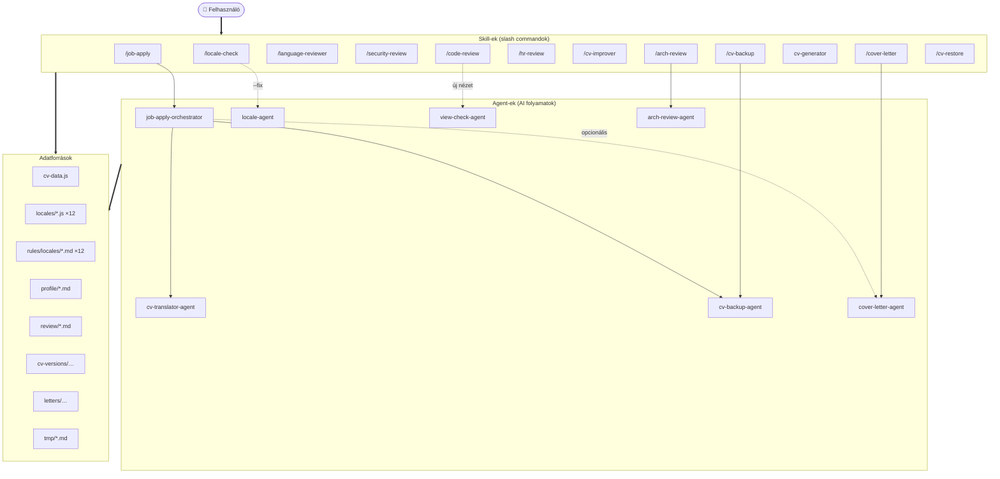

# Skills & Agents — Teljes Referenciaútmutató

## Bevezetés

A CV projekthez egy AI-asszisztens rendszer tartozik, amely **skill-ekből** (slash command-ökből)
és **agent-ekből** (speciális AI-alapú feldolgozók) épül fel. A rendszer Claude Code-ben fut,
és a `.claude/` könyvtár alatt található minden konfiguráció.

**Alapelvek:**
- **Skill-ek** (= `/parancsok`) a felhasználó által közvetlenül használható műveletek
- **Agent-ek** a skill-ek által meghívott specializált AI feldolgozók
- Minden művelet naplózva van a `cv-versions/history.md` fájlban
- Minden review riport a `review/` mappába kerül
- A felhasználói felület nyelve magyar, a fájlnevek és kód angol

---

# 1. Skill-ek Részletes Leírása

## 1.1 Fejlesztési / Karbantartási Skill-ek

---

### `/locale-check` — Locale Kulcsok Ellenőrzése

**Trigger:** `/locale-check` vagy `/locale-check --fix`

**Funkció:** Ellenőrzi, hogy mind a 12 locale fájl (`*-page.js`) ugyanazokat a `labels` kulcsokat
tartalmazza-e, mint az `en-page.js` referencia. Képes automatikusan kiegészíteni a hiányzó
kulcsokat a `--fix` kapcsolóval.

**Hogyan működik:**
1. Kiolvassa az `en-page.js`-ből az összes `labels` kulcsot → ez a referencia
2. Minden másik `*-page.js` fájlt összehasonlít ezzel
3. Jelenti a hiányzó kulcsokat fájlonként

**`--fix` mód:**
- Meghívja a `locale-agent`-et, amely:
  - Valós nyelvekhez (hu, de, fr, es, it): lefordítja az új kulcs értékét
  - Fiktív nyelvekhez (asg, dot, kl, qu, goa, ya): stílus-konzisztens adaptációt készít

**Használati esetek:**
```bash
/locale-check              # csak ellenőrzés, nincs módosítás
/locale-check --fix        # hiányzó kulcsok automatikus kiegészítése
```

**Mit NEM csinál:**
- Nem módosítja az `en.js`-t (az a referencia, read-only)
- Nem töröl kulcsokat
- Csak a `labels` objektumot ellenőrzi, a `content`-et nem

---

### `/code-review` — CV Projekt Kompatibilitási Ellenőrzés

**Trigger:** `/code-review` vagy `/code-review --fix`

**Funkció:** Teljes körű kódreview a CV projekthez. Ellenőrzi a locale teljességet,
aria label megfelelőséget, XSS biztonságot, config hibriditást, és új nézet checklist-et.

**Ellenőrzési területek:**
1. **Locale komplettség** — új kulcsok hozzáadva az összes `*-page.js`-hez?
2. **Aria label megfelelőség** — hardcoded vs. `locale.t()` használat, icon-only gombok
3. **Biztonság** — `.innerHTML` dinamikus tartalommal, `insertAdjacentHTML` ellenőrzés
4. **Config higiénia** — hardcoded URL-ek, localStorage kulcsok
5. **Új nézet checklist** — ha új `cv-*.html` fájlt érzékel, meghívja a `view-check-agent`-et

**`--fix` mód:**
- Csak a fixálható figyelmeztetéseket javítja (pl. hardcoded aria string-ek)
- Biztonsági problémákat NEM auto-fixál — mindig mutatja a változtatást

**Mit NEM csinál:**
- Nem módosít locale fájlokat (azt a `locale-agent` csinálja)
- Nem alkalmaz biztonsági változtatásokat megerősítés nélkül

---

### `/language-reviewer` — Nyelvi Lektorálás

**Trigger:** `/language-reviewer <lang>` vagy `/language-reviewer all`

**Funkció:** Professzionális nyelvi lektorálás. Ellenőrzi a CV tartalmat és UI label-eket
nyelvspecifikus szabályok alapján.

**Paraméterek:**
- `<lang>` — egy specifikus nyelv: `en`, `hu`, `de`, `fr`, `es`, `it`, `asg`, `dot`, `kl`, `qu`, `goa`, `ya`
- `all` — az összes nyelv ellenőrzése

**Ellenőrzési szempontok:**
- Regiszter és hangnem (formális/informális, tegező/magázó)
- Igeidő konzisztencia
- Technikai terminológia helyessége (TypeScript, React, stb.)
- Nyelvspecifikus nyelvtan ( nemek, esetek, igeragozás)
- Kulcsszótár konzisztencia (fiktív nyelveknél)
- `en-page.js`-hez képest hiányzó kulcsok
- Helykitöltő szövegek kulturális illeszkedése

**Mit NEM csinál:**
- Soha nem módosít fájlokat — csak jelent
- Nem javasol tartalmi változtatásokat (skill-ek, tapasztalat, dátumok)

---

### `/security-review` — Biztonsági Audit

**Trigger:** `/security-review` vagy `/security-review --fix`

**Funkció:** A CV oldal interaktív funkcióinak (Hire Me űrlap, Booking modál) spam- és
biztonsági auditja. Mivel a site backend nélküli, a fókusz a kliens-oldali védelmen van.

**Ellenőrzött területek:**
1. **Hire Me űrlap (Formspree):** rate limiting, input validáció, bot védelem, XSS
2. **Booking modál (Google Apps Script):** rate limiting, slot validáció, bot védelem
3. **Egyéb funkciók:** music player, theme toggle, language selector

**Kockázati mátrix:**
- CRITICAL — azonnal kihasználható, inbox/calendar flood
- HIGH — könnyű exploit (incognito, DevTools)
- MEDIUM — mérsékelt erőfeszítés kell
- LOW — elméleti, nehezen kihasználható

**`--fix` mód:**
- Csak kliens-oldali változtatásokat alkalmaz (`shared.js`, `config.js`)
- Megerősítést kér minden változtatáshoz
- NEM auto-fixál: CAPTCHA hozzáadást, GAS szerveroldali validációt, Formspree konfigurációt

**Riport:** `review/YYYY-MM-DD_HHMM_security-review.md`

---

### `/arch-review` — Architektúra Elemzés

**Trigger:** `/arch-review [--focus=...]`

**Funkció:** Mély architekturális elemzés a CV projektről. Feltárja a template duplikációt,
adatstruktúra minőséget, locale rendszer karbantarthatóságát, CSS architektúrát és tooling
lehetőségeket.

**Fókusz opciók:**
| Opció | Elemzett terület |
|-------|------------------|
| `--focus=all` | Minden (alapértelmezett) |
| `--focus=templating` | HTML template duplikáció |
| `--focus=data` | cv-data.js séma és struktúra |
| `--focus=localization` | Locale rendszer (12 fájl, kulcs-szinkron) |
| `--focus=css` | CSS architektúra (változók, breakpointok) |
| `--focus=tooling` | Tooling/DX (build script, validáció) |

**Javaslatok Tier-ek szerint:**
| Tier | Időigény | Példa |
|------|----------|-------|
| Tier 1 — Gyors győzelem | ⚡ < 1 óra | JSDoc typedef hozzáadása |
| Tier 2 — Közepes | 🔧 1–3 nap | Locale validációs script |
| Tier 3 — Stratégiai | 💪 nagyobb | HTML template generator |
| Tier 4 — Tech evolúció | 🏗️ jelentős | Vite dev-only / TypeScript |

**Riport:** `review/YYYY-MM-DD_HHMM_arch-review-FOCUS.md`

---

## 1.2 Tartalom / HR Skill-ek

---

### `/hr-review` — HR & ATS Optimalizációs Review

**Trigger:** `/hr-review [állásleírás]`

**Funkció:** Két módban működik:
1. **Általános mód** (argumentum nélkül) — a CV általános ATS-készültségének értékelése
2. **JD mód** (állásleírással) — kulcsszó-egyezés és célzott optimalizációs javaslatok

**JD mód lépései:**
1. Állásleírás értelmezése (required/preferred skills, responsibilities)
2. Kulcsszó lefedettség vizsgálata a cv-data.js és profile/*.md alapján
3. Pontozás: `OVERALL_SCORE = required_match * 0.7 + preferred_match * 0.3`
4. Változtatási terv: summary átírás, skill sorrend, bullet átfogalmazás, hiányzó skill-ek

**Anti-hallucináció védelem:**
- Minden javaslatnak a `cv-data.js`-ben VAGY `profile/*.md`-ben kell gyökereznie
- Soha nem talál ki új skill-t vagy tapasztalatot
- A `profile/*.md` fájlokat YAML frontmatter alapján szűri

**Riport:** `review/YYYY-MM-DD_HHMM_hr-review-SLUG.md`
**Ha nincs érdemi megállapítás:** nem készül fájl — inline üzenet jelenik meg

---

### `/cv-improver` — HR Review Javaslatok Alkalmazása

**Trigger:** `/cv-improver <review-file.md>`

**Funkció:** Egy `/hr-review` riport ajánlásainak alkalmazása a `cv-data.js`-re.
Minden változtatást előzetesen megmutat és megerősítést kér.

**Folyamat:**
1. HR review riport betöltése és validálása (fejléc ellenőrzés)
2. Változtatási terv felépítése (summary, skill order, rephrase)
3. Terv megjelenítése és jóváhagyás kérése
4. **Automata biztonsági mentés** (`cv-backup-agent` dispatch)
5. Változtatások alkalmazása
6. Locale fordítások újragenerálása (`cv-translator-agent` dispatch)
7. Marker frissítés + audit napló

**Biztonsági védelem:**
- Backup nélkül nem módosít semmit
- Minden változtatást előzetesen mutat
- `unlocatable` elemeket jelent, nem hagyja ki csendben

---

### `/cover-letter` — Motivációs Levél Generálás

**Trigger:** `/cover-letter [állásleírás]`

**Funkció:** Professzionális motivációs levelek generálása angol, magyar és (opcionálisan)
a JD nyelvén. Minden állítás a `cv-data.js`-ben és `profile/*.md`-ben gyökerezik.

**Kimenetek** (`letters/DATE_company_title/`):
| Fájl | Mindig? | Nyelv |
|------|---------|-------|
| `cover-letter-en.md` | ✅ Igen | Angol |
| `cover-letter-hu.md` | ✅ Igen | Magyar |
| `cover-letter-[lang].md` | ❌ Csak ha a JD nyelve de/fr/es/it | JD nyelve |

**Levél struktúra:**
1. **Opening** — specifikus hook: miért pont ez a cég/szerepkör
2. **Para 1** — 2-3 specifikus tapasztalat a JD követelményekhez igazítva
3. **Para 2** — Egy konkrét eredmény/achievement
4. **Para 3** — Rövid illeszkedési jelzés + call to action

**Anti-hallucináció:** Minden bekezdés tartalmaz legalább egy citable állítást az EVIDENCE
térképből.

---

### `/job-apply` — Teljes Álláspályázati Pipeline

**Trigger:** `/job-apply [állásleírás]`

**Funkció:** A legösszetettebb munkafolyamat. Elvégzi a teljes optimalizációs pipeline-t:
JD elemzés → ATS pontozás → cv-data.js módosítás → fordítás → verzió snapshot →
motivációs levél → naplózás.

**Teljes lépéssor:**
```
0a. JD beolvasás (fájl / inline / tmp/jd-draft.md sablon)
0b. Metaadatok kinyerése (title, company, VERSION_BASE)
1.  cv-data.js + profile/*.md betöltése
2.  HR/ATS elemzés (kulcsszó, pontozás, változtatási terv)
2e. Alkalmasági kapu (ha < 40% required match, figyelmeztet)
3.  Döntés: ha OVERALL_SCORE >= 90% és nincs változtatás → stop
4.  Terv megjelenítése és jóváhagyás
6.  cv-data.js módosítása
7.  cv-translator-agent dispatch (11 locale fordítás)
7b. Fordítási minőség spot-check
7c. JS szintaxis validáció (validate-locale-syntax.py)
7d. Fordítási hossz validáció (check-translation-lengths.py --json)
    → Hibás esetén targetált javítási ciklus (--lang=hu,de szűrővel a re-run-okon)
    → Max 3 iteráció, utána graciőz kilépés
8.  cv-backup-agent dispatch (snapshot)
8b. cover-letter-agent dispatch (automata)
8c. Alkalmazás regisztráció (JD mentés, marker, log)
9.  Végeredmény jelentés
```

**Alkalmasági kapu (Step 2e):**
Ha `REQUIRED_SCORE < 40%` ÉS nincs releváns `profile/*.md` bizonyíték, figyelmezteti
a felhasználót és explicit `igen`-t kér a folytatáshoz.

**Verzió snapshot:** `cv-versions/DATE_company_title/` — tartalmazza:
- `cv-data.js` (optimalizált, metaadat fejléccel)
- `locales/` (11 locale fájl)
- `job-description.md` (formázott állásleírás)
- `cover-letter-en.md` + `cover-letter-hu.md` (+ opcionális JD nyelvű levél)

---

## 1.3 Generátor Skill

---

### `cv-generator` — CV Adat Generálás Profile Fájlokból

**Trigger:** Agent tool hívás (vagy közvetlen dispachtel)

**Funkció:** Teljes `scripts/cv-data.js` generálása a `profile/*.md` fájlokból.
Használd, ha a `cv-data.js` hiányzik, sérült, vagy újra kell generálni.

**Működés:**
1. `profile/*.md` fájlok beolvasása és YAML frontmatter alapján kategorizálása
2. Munkahelyi tapasztalatok kinyerése (10 cég, a mechanikai szerepektől a frontendig)
3. Identity, education, community, hobbyProjects, skillGroups összeállítása
4. `cv-data.js` generálása a pontos JS formátumban (single quotes, trailing commas)
5. 12 locale fájl ellenőrzése/megtartása (content:null új fájlokhoz)

**`--dry-run` mód:**
- Előnézetet mutat anélkül, hogy bármit írna
- Hasznos, mielőtt felülírnád a meglévő cv-data.js-t

**Biztonsági védelem:**
- Ha a `cv-data.js` már létezik, automata backup készül (`cv-backup-agent`) a felülírás előtt
- Soha nem talál ki tartalmat — minden adatnak a `profile/*.md`-ben kell gyökereznie
- A játék térkép koordinátái (8 station) FIXEK — soha nem változnak

**Példák:**
```bash
# Agent tool hívás:
# "Futtasd a cv-generator agentet. --dry-run"
# "Futtasd a cv-generator agentet."
```

---

## 1.4 Backup / Restore Skill-ek

---

### `/cv-backup` — Kézi Snapshot

**Trigger:** `/cv-backup [label]`

**Funkció:** Pillanatnyi állapot mentése a `cv-data.js`-ről és minden locale fájlról.

**Példák:**
```bash
/cv-backup                        → cv-versions/2026-06-13_HHMM_manual/
/cv-backup pre-refactor           → cv-versions/2026-06-13_HHMM_manual_pre-refactor/
/cv-backup before-big-edit        → cv-versions/2026-06-13_HHMM_manual_before-big-edit/
```

**Mikor használd:**
- Kézi szerkesztés előtt
- Refaktor előtt
- Kísérletezés előtt
- Amikor nem állásra pályázol, de menteni akarod az állapotot

**Tipp:** A snapshotok a `cv-versions/applications.md`-be és `history.md`-be is bekerülnek.

---

### `/cv-restore` — Visszaállítás Snapshotból

**Trigger:** `/cv-restore <mappa-név>`

**Funkció:** Visszaállítja a `cv-data.js`-t és minden locale `content`-et egy korábbi
snapshotból.

**Folyamat:**
1. Snapshot metaadatok megjelenítése (pozíció, dátum, ATS%, módosítások)
2. Felülírandó fájlok listázása
3. Megerősítés kérése
4. **Automata pre-restore backup** (a jelenlegi állapot mentése)
5. Fájlok visszaállítása
6. Marker frissítés + audit napló

**Biztonság:**
- Megerősítés nélkül nem módosít semmit
- A pre-restore backup automatikus (kivéve `--no-backup`)
- A marker a visszaállított verzióra áll

**Parancssori segéd:**
```bash
python .claude/skills/cv-restore/scripts/cv-restore.py <folder>       # restore
python .claude/skills/cv-restore/scripts/cv-restore.py --list          # lista
python .claude/skills/cv-restore/scripts/cv-restore.py <folder> --yes  # megerősítés nélkül
```

---

# 2. Agent-ek Részletes Leírása

Az agent-ek a skill-ek által meghívott, specializált AI-alapú folyamatok. Közvetlenül is
meghívhatók, ha a felhasználó pontosan tudja, mit szeretne.

---

## 2.1 Alap Agent-ek

### `cv-translator-agent` — CV Tartalom Fordító

**Meghívja:** `job-apply-orchestrator`, `cv-improver`

**Funkció:** Az angol `cv-data.js`-ben történt változások propagálása mind a 11 locale fájl
`content` mezőjébe. Csak a ténylegesen változott mezőket fordítja — nem fordít újra
változatlan tartalmat.

**Bemeneti paraméterek:**
| Paraméter | Típus | Kötelező? | Leírás |
|-----------|-------|-----------|--------|
| `CHANGED_FIELDS` | objektum | igen | Summary, bullets, jobDescriptions változások |
| `JD_TITLE` | string | opcionális | Hangnem kalibrációhoz |
| `JD_COMPANY` | string | opcionális | Hangnem kalibrációhoz |
| `TARGET_LOCALES` | string[] | nem | Alapértelmezett: mind a 11 |
| `TARGETED_FIXES` | objektum | nem | Célzott hossz-javítások |

**Működés:**
1. Betölti a nyelvspecifikus szabályfájlokat (`.claude/rules/locales/<lang>.md`)
2. A meglévő tartalmat kontextusként használja a stílus kalibrációhoz
3. Valós nyelvek (hu, de, fr, es, it): pontos fordítás
4. Fiktív nyelvek (asg, dot, kl, qu, goa, ya): stílus-adaptáció a meglévő szótárral
5. **HARD constraint:** betartja a fordítási hossz budget-et (-5% / +2% tűrés)

**TARGETED_FIXES formátum (hossz-korrekcióhoz):**
```json
{
  "hu": [
    { "field": "summary", "mode": "expand", "adjustBy": 15 },
    { "field": "workplace:aegex", "mode": "compress", "adjustBy": -50 }
  ]
}
```
- `mode: "expand"` → szöveg bővítése (TOO_SHORT)
- `mode: "compress"` → szöveg tömörítése (TOO_LONG)
- `mode: "translate"` → újrafordítás angolból

**Munkahely TOTAL repair stratégia:**
- Minden komponens (description, bullets, project bullets) külön mérése
- Legjobb jelölt kiválasztása (ahol a módosítás természetes)
- Csak a kiválasztott komponens módosítása, új összeg ellenőrzése
- Validátor futtatása a megerősítéshez

**Kimenet:** Jelentés arról, mely locale fájlok frissültek.

---

### `cv-backup-agent` — Verzió Snapshot Készítő

**Meghívja:** `job-apply-orchestrator`, `cv-backup` skill, `cv-improver`

**Funkció:** Pontos időbeli snapshot készítése a `cv-data.js`-ről és minden locale fájlról.

**Bemeneti paraméterek:**
| Paraméter | Típus | Kötelező? | Leírás |
|-----------|-------|-----------|--------|
| `MODE` | string | igen | `"job-apply"` vagy `"manual"` |
| `VERSION_BASE` | string | igen | Mappanév base (pl. `2026-06-15_0915_manual`) |
| `JD_TITLE` | string | igen | Pozíció neve |
| `JD_COMPANY` | string | igen | Cég neve |
| `JD_SENIORITY` | string | opcionális | Szenioritás |
| `JD_DOMAIN` | string | opcionális | Domain |
| `OVERALL_SCORE` | string | opcionális | ATS% |
| `REQUIRED_SCORE` | string | opcionális | Required% |
| `PREFERRED_SCORE` | string | opcionális | Preferred% |
| `CHANGE_SUMMARY` | string | opcionális | Változtatások leírása |
| `HR_REVIEW_FILE` | string | opcionális | HR review report elérés |
| `DATE` | string | igen | YYYY-MM-DD |
| `TIME` | string | igen | HHMM |

**Verzióütközés kezelés:**
- Ha a `VERSION_BASE`-re már létezik mappa: [a] új verzió (-v2, -v3...) / [b] felülírás / [n] leáll
- Minden snapshot tartalmaz: `cv-data.js` (metaadat fejléccel) + `locales/` (12 JS fájl)

**Fontos:** A locales/ könyvtár file copy-val másolódik, nem JSON konverzióval —
így megmarad az eredeti JS formátum (single quotes, trailing commas, stb.).

---

### `cover-letter-agent` — Motivációs Levél Író

**Meghívja:** `job-apply-orchestrator`, `cover-letter` skill

**Funkció:** Professzionális, személyre szabott motivációs levelek írása angol, magyar
és JD-nyelvű változatban.

**Bemeneti paraméterek:**
| Paraméter | Típus | Kötelező? | Leírás |
|-----------|-------|-----------|--------|
| `JD_TITLE` | string | igen | Pozíció |
| `JD_COMPANY` | string | igen | Cég |
| `JD_DOMAIN` | string | opcionális | Domain |
| `JD_SENIORITY` | string | opcionális | Szenioritás |
| `JD_REQUIRED` | string[] | igen | Elvárt skill-ek |
| `JD_RESPONSIBILITIES` | string[] | igen | Felelősségek |
| `JD_PRIMARY_LANGUAGE` | string | igen | JD nyelve |
| `PROFILE_DATA` | objektum/null | igen | Profil adatok |
| `CV_SUMMARY` | string | igen | Összefoglaló |
| `CV_BULLETS_ALL` | array | igen | Bullet-ek |
| `CV_EXPERIENCE_SUMMARY` | string | igen | Tapasztalatok |
| `OUTPUT_FOLDER` | string | igen | Kimeneti mappa |
| `DATE` | string | igen | Dátum |
| `TIME` | string | igen | Idő |

**Bizonyíték alapú működés:**
1. Bizonyíték térkép építése a `cv-data.js` + `profile/*.md` alapján
2. Legjobb bizonyítékok kiválasztása a JD-hez (OPENING_HOOK, PARA1-3)
3. Levél írása 3-4 tömör bekezdésben
4. Anti-hallucináció: minden állításnak citable-nek kell lennie

**Kimenet:**
- `OUTPUT_FOLDER/cover-letter-en.md` (mindig)
- `OUTPUT_FOLDER/cover-letter-hu.md` (mindig)
- `OUTPUT_FOLDER/cover-letter-[de|fr|es|it].md` (ha JD nyelve ettől eltér)

---

### `locale-agent` — Locale Kulcs Hozzáadó

**Meghívja:** `/locale-check --fix`

**Funkció:** Új `labels` kulcsok hozzáadása mind a 12 `*-page.js` fájlhoz.

**Bemenet:**
- `NEW_KEYS` — kulcsnevek listája
- `EN_VALUES` — angol referencia értékek
- `TARGET_FILES` — mely fájlokat frissítse (alapértelmezett: mind a 11 nem-angolt)

**Fordítási stratégia:**
| Nyelv | Típus | Megközelítés |
|-------|-------|-------------|
| hu | Valós | Pontos fordítás |
| de | Valós | Pontos fordítás |
| fr | Valós | Pontos fordítás |
| es | Valós | Pontos fordítás |
| it | Valós | Pontos fordítás |
| asg | Fiktív | Stílus-konzisztens, óészaki hangulat |
| dot | Fiktív | Rövid, mássalhangzó-gazdag szavak |
| kl | Fiktív | Kemény hangzók, aposztrófok |
| qu | Fiktív | Elvies, dallamos magánhangzók |
| goa | Fiktív | Pompás, parancsoló hangvétel |
| ya | Fiktív | Gutturális, ritka szavak |

**Korlátok:**
- Soha nem módosítja az `en-page.js`-t (az a referencia)
- Soha nem módosít `<lang>.js` fájlokat (csak `*-page.js`)
- Meglévő kulcsokat soha nem töröl

---

### `view-check-agent` — Új Nézet Ellenőrző

**Meghívja:** `/code-review` (új view detektálásakor)

**Funkció:** Ellenőrzi, hogy egy új CV nézet megfelel-e a projekt kötelező elemeinek.

**Ellenőrzési checklist:**
| # | Ellenőrzés | Mit vizsgál |
|---|------------|-------------|
| 1 | Music player | `musicPlayerHTML()` + `initMusicPlayer()` importálva? |
| 2 | Hire Me modál | `hireModalHTML()` + `initHireModal()` használva? |
| 3 | Booking modál | `bookingModalHTML()` + `initBookingModal()` használva? |
| 4 | Toast container | `<div id="cv-toaster-container">` jelen van? |
| 5 | Carousel regisztráció | `.cv-slide` elem az `index.html`-ben? |
| 6 | Locale kulcsok | Minden `locale.t()` kulcs létezik `en.js`-ben? |
| 7 | Reszponzív CSS | Van `@media` query? Megvan a mobil breakpoint? |
| 8 | Accessibility | Van aria-label minden icon-only gombon? |
| 9 | Biztonság | Nincs `.innerHTML` dinamikus tartalommal? |

**Kimenet:** PASS / FAIL / WARN jelentés minden ellenőrzésre.

---

### `arch-review-agent` — Architektúra Elemző

**Meghívja:** `/arch-review` skill

**Funkció:** Mély architekturális elemzés a teljes kódbázison. Öt dimenzióban vizsgál:
templating, data, localization, CSS, tooling.

**Elemzési folyamat:**
1. Teljes kódbázis inventory (HTML, JS, CSS, locale fájlok)
2. 5 dimenziós analízis (a focus-tól függően)
3. Pontozás: Pain Level (🔴/🟡/🟢) × Improvement Potential × Effort
4. Proposálok összeállítása Tier-ek szerint
5. Riport írása a `.claude/rules/arch-review-report-format.md` sablon alapján

**Visszatérési értékek:**
- `REPORT_FILE` — riport fájl elérési útja
- `PAIN_HIGH/MED/LOW` — fájdalompont listák
- `PROPOSAL_COUNTS` — tier-enkénti proposál számok
- `TOP_RECOMMENDATION` — legfontosabb teendő

**Korlát:** Csak olvasás — soha nem módosít fájlokat.

---

### `job-apply-orchestrator` — Álláspályázati Vezérlő

**Meghívja:** `/job-apply` skill

**Funkció:** A teljes job-apply pipeline orchestrálása. Ez a legbonyolultabb agent —
11 lépésből álló folyamatot vezényel le, más agent-eket hív meg.

**Teljes lépéssor:**
```
Step 0 - JD parse + metadata
Step 1 - CV adatok + profil betöltése
Step 2 - HR/ATS elemzés + pontozás + változtatási terv
Step 2e - Alkalmasági kapu
Step 3 - Döntés (90%+ és nincs változtatás → stop)
Step 4 - Terv megjelenítése + jóváhagyás
Step 6 - cv-data.js módosítása
Step 7 - cv-translator-agent dispatch
Step 7b - Fordítási minőség spot-check
Step 7c - JS szintaxis validáció
Step 7d - Fordítási hossz validáció (max 3 iteráció)
Step 8 - cv-backup-agent dispatch
Step 8b - cover-letter-agent dispatch
Step 8c - Alkalmazás regisztráció (JD mentés + marker + log)
Step 9 - Végeredmény
```

**Kritikus biztonsági lépések:**
- Step 4: Minden változtatást jóvá kell hagyni
- Step 2e: Ha a jelölt nem felel meg, figyelmeztet
- Step 7d: Max 3 iteráció, utána graciőz kilépés

---

# 3. Közös Adatforrások és Fájlok

## 3.1 Adatforrások

| Fájl / Mappa | Leírás | Ki írja |
|-------------|--------|---------|
| `scripts/cv-data.js` | CV adatok egyetlen forrása | `/job-apply`, `/cv-improver`, `cv-generator` |
| `scripts/locales/*.js` | 12 locale fájl (en + 11 fordítás) | `cv-translator-agent`, `locale-agent` |
| `scripts/locales/*-page.js` | 12 UI label fájl | `locale-agent` |
| `scripts/config.js` | Feature flag-ek, URL-ek, storage kulcsok | Kézzel |
| `scripts/shared.js` | Közös komponensek (modálok, music player) | Kézzel |
| `profile/*.md` | Karrier profil (anti-hallucináció bázis) | Kézzel |

## 3.2 Kimeneti Fájlok

| Fájl / Mappa | Leírás | Ki írja |
|-------------|--------|---------|
| `review/*.md` | Review riportok (hr, security, arch) | `/hr-review`, `/security-review`, `/arch-review` |
| `cv-versions/APP_ID/` | Verzió snapshot mappák | `cv-backup-agent` |
| `cv-versions/applications.md` | Pályázati index | `job-apply-orchestrator` |
| `cv-versions/history.md` | Audit napló (append-only) | `cv-ledger.py` |
| `letters/DATE_company_title/` | Motivációs levelek | `cover-letter-agent` |
| `tmp/jd-draft.md` | Ideiglenes JD sablon | `/job-apply` (csak argumentum nélkül) |

## 3.3 CLI Segéd Script-ek

| Script | Skill-hez tartozik | Használat |
|--------|-------------------|-----------|
| `.claude/scripts/check-translation-lengths.py` | — (pipeline) | Fordítási hossz validáció |
| `.claude/scripts/validate-locale-syntax.py` | — (pipeline) | JS szintaxis validáció |
| `.claude/scripts/cv-ledger.py` | — (megosztott) | Marker, napló, verzió lekérdezés |
| `.claude/skills/cv-backup/scripts/cv-backup.py` | `/cv-backup` | Snapshot CLI-ből |
| `.claude/skills/cv-restore/scripts/cv-restore.py` | `/cv-restore` | Restore CLI-ből |
| `.claude/skills/locale-check/scripts/locale-check.py` | `/locale-check` | Locale ellenőrzés CLI-ből |

---

# 4. Gyakori Használati Minta

## 4.1 Új állásra jelentkezés

```bash
# 1. Lépés: ATS review a cv-data.js módosítása nélkül
/job-apply "Senior Frontend Engineer at Acme Corp. Requirements:..."

# VAGY fájlból:
/job-apply allasleiras.txt

# VAGY sablonból (interaktív):
/job-apply
# → tmp/jd-draft.md kitöltése, majd "kész"

# 2. Lépés: A pipeline végigfut, eredmény:
#   ✅ cv-data.js optimalizálva
#   ✅ 11 locale frissítve
#   ✅ Snapshot: cv-versions/2026-06-15_acme-corp_senior-frontend-engineer/
#   ✅ Cover letter-ek angolul + magyarul
```

## 4.2 Kézi CV módosítás

```bash
# 1. Backup a jelenlegi állapotról
/cv-backup before-edits

# 2. cv-data.js kézi szerkesztése...
# (a fájl szerkesztése a kedvenc editorban)

# 3. Változások propagálása a locale-okba
# → közvetlen agent hívás:
# "Futtasd a cv-translator-agent agentet. A megváltozott mezők:
#   summary: régi → új
#   Aegex bullet 1: régi → új"

# VAGY használd a /cv-improver-t egy HR review report-ból
```

## 4.3 Visszaállítás

```bash
# 1. Backupok listázása (a mappa nevek alapján)
/cv-restore 2026-06-15_0915_manual_pre-refactor

# 2. Megerősítés után automatikus pre-restore backup + visszaállítás

# CLI-ből is:
python .claude/skills/cv-restore/scripts/cv-restore.py --list
```

## 4.4 Rendszeres karbantartás

```bash
# Heti/2 hetente:
/locale-check              # locale kulcsok ellenőrzése
/code-review                 # teljes kódreview
/language-reviewer all     # nyelvi lektorálás

# Periodikusan:
/security-review           # spam/flood védelem audit
/arch-review               # architektúra elemzés
```

---

# 5. Hibakeresési Tippek

## 5.1 Gyakori problémák

| Probléma | Valószínű ok | Megoldás |
|----------|-------------|----------|
| `/locale-check` hiányzó kulcsokat jelez | Új UI elem került be, de nincs minden locale-ban | `/locale-check --fix` |
| `check-translation-lengths.py` hibát jelez | Fordítás túl hosszú/rövid | A pipeline Step 7d automatikusan javítja max 3 körben |
| JS szintaxis hiba locale fájlban | Aposztróf single-quote stringben | `validate-locale-syntax.py --json` megmondja a pontos helyet |
| `cv-translator-agent` nem talál szabályfájlt | `.claude/rules/locales/<lang>.md` hiányzik | Ellenőrizd a fájl meglétét |
| Pipeline leáll a Step 4-nél | Változtatási terv elutasítva | Futtasd újra és fogadd el, vagy manuálisan módosíts |

## 5.2 Kilépési kódok

| Script | 0 | 1 |
|--------|---|---|
| `check-translation-lengths.py` | Minden hossz a sávon belül | Van TOO_SHORT vagy TOO_LONG |
| `validate-locale-syntax.py` | Minden fájl valid JS | Van szintaktikai hiba |
| `cv-ledger.py mark` | Marker sikeresen beállítva | Hiba a marker beállításában |
| `cv-ledger.py log` | Napló sor sikeresen hozzáadva | Hiba a naplózásban |

## 5.3 Mit tegyél ha...

**...a pipeline végtelen hurokba kerül?**
- Nem lehetséges — a Step 7d-nek max 3 iterációs korlátja van

**...a fordító agent rosszul fordít?**
- Futtasd: `/language-reviewer <lang>` — csak jelent, nem javít
- Ha a hiba ismétlődő, frissítsd a `.claude/rules/locales/<lang>.md` szabályfájlt

**...a motivációs levél gyenge?**
- A levél sablon — szabadon szerkeszthető a `cover-letter-*.md` fájlokban
- Ellenőrizd, hogy a `profile/*.md` fájlok elég részletesek-e
- Futtasd: `/language-reviewer en` és `/language-reviewer hu`

---

# 6. Verziókövetési Rendszer

A teljes CV állapot egyetlen azonosítóval követhető: **APP_ID** = snapshot mappa neve
(= `DATE_company_title`).

**Három réteg:**
1. **Live marker blokk** — `cv-data.js` + 12 `<lang>.js` fájl tetején:
   ```
   // @job-application: APP_ID — Title @ Company
   // @cv-last-change: YYYY-MM-DD HHMM — művelet (aktor)
   ```
2. **Audit napló** — `cv-versions/history.md` (append-only)
3. **Pályázati index** — `cv-versions/applications.md` (egy sor / APP_ID)

**Minden mutáció a `cv-ledger.py`-n keresztül történik** — soha nem kézzel írva a markert.

A `cv-ledger.py` támogatott műveletei:
| Parancs | Funkció |
|---------|---------|
| `mark --set-application ...` | Marker beállítása új alkalmazáshoz |
| `mark --operation ...` | Csak `@cv-last-change` frissítése |
| `log --category ... --operation ...` | Audit napló sor hozzáadása |
| `current` | Aktuális marker kiolvasása |

---

# 7. Szabályfájlok Referencia

| Fájl | Tartalom |
|------|----------|
| `.claude/rules/locales/<lang>.md` (×12) | Nyelvspecifikus fordítási szabályok |
| `.claude/rules/translation-length.md` | Fordítási hosszkorlát szabály |
| `.claude/rules/localization.md` | Locale rendszer használati útmutató |
| `.claude/rules/js-syntax-validation.md` | JavaScript szintaxis validációs szabály |
| `.claude/rules/aria-labels.md` | Aria label követelmények |
| `.claude/rules/new-view.md` | Új nézet létrehozás checklist |
| `.claude/rules/shared-api.md` | `shared.js` exportok referenciája |
| `.claude/rules/responsive.md` | Reszponzív CSS szabályok |
| `.claude/rules/career-profile-usage.md` | Profile fájlok YAML-szűrési logikája |
| `.claude/rules/version-snapshot-format.md` | Verzió mappa formátumok |
| `.claude/rules/jd-draft-template.md` | JD sablon formátum |
| `.claude/rules/arch-review-report-format.md` | Arch review riport sablon |
| `.claude/rules/script-placement.md` | Script mappa szétválasztási szabály |

---

# 8. Architektúra Ábra



---
*Utolsó frissítés: 2026. június*
*A dokumentum a `.claude/` könyvtárban található SKILL.md és agent fájlok alapján készült.*
